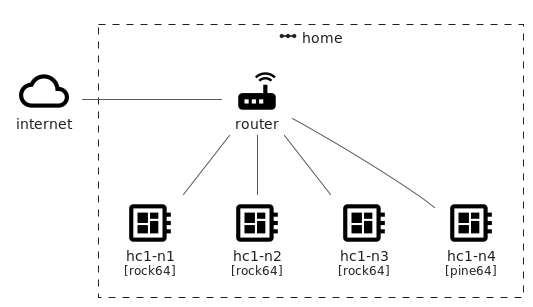
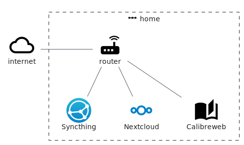

= homecloud : a cloud at home with Docker Swarm, Ceph and Syncthing
// METADATA
:doctype: article
:author: Thibault Morin
:revdate: 2020-11-18
:homepage: https://github.com/tmorin/homecloud-ansible
:toc:
// FOOTNOTES
:fn-whats-a-linux-container: footnote:[https://www.redhat.com/en/topics/containers/whats-a-linux-container]
:fn-what-is-container-orchestration: footnote:[https://www.redhat.com/en/topics/containers/what-is-container-orchestration]

== Introduction

`homecloud` aims to provide a cloud at home hosted on ARM boards like Raspberry Pi and based on Docker Swarm, Ceph and Syncthing.

The main artifact is an https://www.ansible.com[Ansible] collection designed to bootstrap a ready to use cloud.

== A casual use case

Bob wants to be as much as autonomous about private data like contacts, pictures, backups ...

The purpose of this section is to describe a use case of a `homecloud` cluster based on four ARM boards.
All of them are manufactured by https://www.pine64.org[Pine64].

|===
|Hostname|Type|Architecture|Memory|Operating System

|hc1-n1
|https://www.pine64.org/devices/single-board-computers/rock64/[rock64]
|aarch64
|4G
|Armbian

|hc1-n2
|https://www.pine64.org/devices/single-board-computers/rock64/[rock64]
|aarch64
|4G
|Armbian

|hc1-n3
|https://www.pine64.org/devices/single-board-computers/rock64/[rock64]
|aarch64
|4G
|Armbian

|hc1-n4
|https://www.pine64.org/devices/single-board-computers/pine-a64-lts/[pine-a64-lts]
|aarch64
|2G
|Armbian
|===

.The cluster overview from the ARM boards' point of view

The four boards are inter-connected using the home's router which is already connected to internet.

The purpose of the cluster is to host the following end services:

- https://nextcloud.com[nextcloud]: a suite of client-server software for creating and using file hosting services
- https://github.com/janeczku/calibre-web[calibreweb]: web app for browsing, reading and downloading eBooks stored in a Calibre database
- https://syncthing.net/[syncthing]: a free, open-source peer-to-peer file synchronization application

.The cluster overview from the final services point of view

However, to properly operate the above listed final services, two principles are highly emphasis: containerized workloads and container orchestration.

== The principles

The first principle, the containerized workload (i.e. famous _container_), provides many benefits{fn-whats-a-linux-container} about the packaging, distribution and usage of the services them-self.

The key characteristics are:

- Portability : a container can be easily deployed in a container environment whatever the host's operating system within the respect of the container's and host's architecture.
- Configurability : a container can be easily configured about its infrastructure (cpu, memory ...) but also about the underlying workload (overriding containerized file or environment variables).
- Isolation : a container cannot exceed its infrastructure limit and so cannot impact sibling running containers.
- Efficient Disk Usage : a containerized workload needs less disk usage than virtualized one.

The second one, the container orchestration, provides also many benefits{fn-what-is-container-orchestration} about the overall handling of containerized workloads.

The key characteristics are:

- Automatic deployments : a container orchestrator manages it-self the deployment process of containerized workloads across the nodes.
- Container management : a container orchestrator provides services to monitor and interact with containerized workloads deployed among the cluster nodes.
- Resource allocation : a container orchestrator monitors and manages the resources to satisfy the requirements of the deployed containerized workloads.
- Networking configuration : a container orchestrator manages it-self the networking configuration to provide the isolation or inter-connection between containerized workloads according to their needs.

However, a wish list of final services, and a couple of principles are not enough to provide an efficient cluster.
Some pieces are still missing: a set of building blocks able to support the final services embracing the principles.

== The building blocks

The purpose of the building blocks are to support the execution of the final services.
Some building blocks are parts of the virtual world whereas others to the physical one.

=== The container engine and orchestrator

https://www.docker.com[Docker] is one of the most popular technology about _container_, and moreover, ready-to-use to almost all architectures.
Therefore, because `homecloud` must be easy to bootstrap and configure for at least `amd64` and `aarch64` architectures, Docker is the good candidate for the container engine.

Luckily Docker shipped a ready-to-use container orchestrator: https://docs.docker.com/engine/swarm/[Docker Swarm].
Therefore, according to the domestic usage of `homecloud`, Docker Swarm is the good candidate for the container orchestration because no overhead won't be added to technology.

Nevertheless, additional building blocks have to be added to the virtual stack.

=== The distributed file system

Deploying containers across nodes of a cluster is easy to do with Docker Swarm.
However, it won't manage the availability of the data across the nodes of the cluser.

For instance, if a container hosting a database is destroyed and then re-created on a new node by the orchestrator, by default, the new container won't start with the data related to the destroyed container.

In order to get the availability of the data among the nodes of the cluster, a distributed file system has to be configured.

https://ceph.io/[Ceph] is the is one of the most popular technology about distributed file system.
Moreover, it can be easily integrated in a Docker environment.
Therefore, Ceph is the good candidate for the distributed file system.

Now containers are able to recover their data over their lifecycles, there is another topic to deal with: how final services will be found and reached from Internet?

=== The reverse proxy

The purpose of a reverse proxy is to handled first the requests coming from the external world.
In the `homecloud` context, the reverse proxy handles the requests coming from Internet.
The handling of incoming requests can be straight forward or much complex: enhancement of requests, security, load balancing ...
At the end, the reverse proxy routes the requests to the right _back end_ into the internal world.

https://traefik.io[Traefik] is the is one of the most popular technology about reverse proxy.
Moreover, it can be easily integrated in a Docker environment.
Therefore, Traefik is the good candidate for the reverse proxy.

=== Monitoring and alerting

- https://www.influxdata.com[Influxdata]: monitoring and alerting

=== Container management

- https://www.portainer.io[Portainer]: monitoring and management of the Docker Swarm
