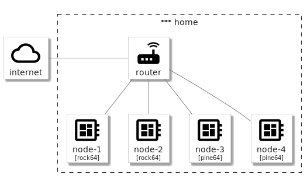

# homecloud

## Introduction

`homecloud` aims to provide a cloud at home hosted on ARM boards like Raspberry Pi and based on Docker Swarm, Ceph and Syncthing.

The main artifact is an [Ansible] collection designed to bootstrap a ready to use cloud.

[Ansible]: https://www.ansible.com

## The use case

