= homecloud: a cloud at home with Kubernetes and Syncthing
// METADATA
:doctype: article
:author: Thibault Morin
:revdate: 2021-09-30
:homepage: https://github.com/tmorin/homecloud-ansible
:toc:
:icons: font

[abstract]
== Abstract

Provide resources to bootstrap and manage:

1. an private cloud
2. and self-hosted services

The main artifact is an Ansible collection.

== Introduction

The genesis of this initiative comes from two Framasoft momentum: De-google-ify Internet <<dgo>>; and its following one: Contributopia <<cpa>>.
The main concern is _digital independence_.
It's about surveillance and privacy of what we are, but also centralization of actors and usages.

According to this context, the initiative provides a way to self-host services which deal with private data.
It mainly leverages on n private cloud to support its realization.
That means to run a cloud at home, so the name `homecloud`.

A _cloud_ is a network of hardware and software elements which provides dynamically and efficiently common resources (e.g. servers, storage ...) <<dcc>> .
Obviously, the purpose is not to re-do the infrastructure of big actors in the living room.

However, a cluster of affordable development boards (like _Raspberry PI_) associated to open source technologies (like _Kubernetes_) can be enough to get a working tiny private cloud ... in the living room.

== Vision

The primary goal of `homecloud` is to provide the main services which manage private data (files sharing, contacts and calendars) storing it locally.

The secondary goal of `homecloud` is to provide services embracing both organizational structures: centralized and decentralized.

`homecloud` is used by three kind of persons.
Those which take care of their private data.
Those which are skilled enough to administrate the system.
And finally those which have been temporally allowed to interact with some services provided by the system.
Additionally, `homecloud` can also be used by external systems like agents installed on smartphones, laptops, etc.

.Vision: Context Diagram of `homecloud`
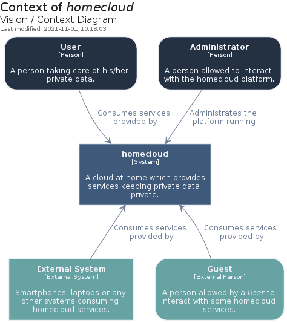

=== Business scenarios

==== Photos Synchronization

[cols="^.^h,3a"]
|===
|Problem
|Photos took on mobile phones are usually, by convenience, synchronized in a third party cloud.
Therefore, the photos binaries are stored somewhere in the world, escaping their owner's control.
Once synchronized, the mobile phone's owner can browse and manage them according to the vendor's user interfaces.

|Environment
|The synchronization process can be centralized or decentralized but also unidirectional or bidirectional.

|Outcomes
|With `homecloud`, the photos can also be synchronized but still remain private because they are stored locally, under the control of the mobile phone's owner.
Moreover, they can also be managed using friendly user interfaces.

|Human Actors
|
- the owner of the photos

|System Actors
|
- a centralized system with authorized agents on the mobile phone(s)
- and/or a decentralized system leveraging on a network of peer-to-peer agents distributed on nodes (servers, computers, mobile phones ...)
|===

.Business Scenario: Usecase Diagram of Photos Synchronization
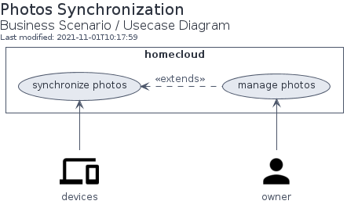

===== Value Stream

[cols="^.^h,3a"]
|===
|Name
h|Handle Photos Changes
|Description
|The activities involved in keeping photos private from the device to `homecloud`.
|Stakeholder
|The owner of the photos.
|Value
|The photos are synchronized and can be managed with interfaces provided by `homeloud`.
|===

.Business Scenario: Value Stream of Handle Photos Changes

.Business Scenario: Value Stream Stages of Handle Photos Changes
|===
|Value Stream Stage|Description|Participating Stakeholders|Entrance Criteria|Exit Criteria|Value Items

|Change Photos on Device
|The act of taking or deleting photos on a device like a smartphone.
|Owner of the photos
|Owner using its device
|Photos taken or deleted
|Photos managed by the user it-self

|Synchronize Photos
|The act of replicating changes across systems.
|Owner of the photos
|Photos taken or deleted
|Photos synchronized
|Changes applied everywhere

a|Manage Photos on `homecloud`
|The act of copying, moving or deleting photos.
|Owner of the photos
|Photos synchronized
|Changes to synchronize
|Photos managed according to owner wishes
|===

==== Files Synchronization

[cols="^.^h,3a"]
|===

|Problem
|For convenience or backup purpose, it is common to synchronized files among devices or with centralized systems.
For instance, to back up personal documents in case of disasters (e.g. hard disk crash) or to transfer user files from an old computer to a new one.
Most of the built-in (and also convenient) solutions of famous operating systems like _Windows_ or _Android_ are mainly cloud based.
Therefore, for a while, or permanently, the files are stored in a third party cloud, escaping the owner's control.

|Environment
|The synchronization process can be centralized or decentralized but also unidirectional or bidirectional.

|Outcomes
|With `homecloud`, the files can also be synchronized but still remain private because they are stored locally, under the control of the mobile phone's owner.

|Human Actors
|
- the owner of the files

|System Actors
|
- a centralized system with authorized agents on edge nodes (computer, mobile phones ...)
- and/or a decentralized system leveraging on a network of peer-to-peer agents distributed on nodes (servers, computers, mobile phones ...)
|===

.Business Scenario: Usecase Diagram of Files Synchronization
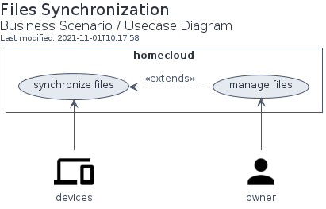

===== Value Stream

[cols="^.^h,3a"]
|===
|Name
h|Handle Files Changes
|Description
|The activities involved in keeping files private from the device to `homecloud`.
|Stakeholder
|The owner of the files.
|Value
|The files are synchronized and can be managed with interfaces provided by `homeloud`.
|===

.Business Scenario: Value Stream of Handle Files Changes

.Business Scenario: Value Stream Stages of Handle Files Changes
|===
|Value Stream Stage|Description|Participating Stakeholders|Entrance Criteria|Exit Criteria|Value Items

|Change Files on Device
|The act of creating, updating or deleting files on a device like a laptop.
|Owner of the files
|Owner using its device
|Files mutated
|Files managed by the user it-self

|Synchronize Files
|The act of replicating changes across systems.
|Owner of the files
|Files mutated
|Files synchronized
|Changes applied everywhere

a|Manage Files on `homecloud`
|The act of copying, moving or deleting files.
|Owner of the files
|Files synchronized
|Changes to synchronize
|Files managed according to owner wishes
|===

==== Files Sharing

[cols="^.^h,3a"]
|===

|Problem
|The synchronization of photos or files leads to a dynamic replication of data.
However, for some cases the replication is overkill.
For instance, to share a file over Internet to a well-known contact.
But also, to stream on the TV a content available in the local network.
In those cases, it is just enough share the content, because only the consumer knows if the content has to be stored permanently or not once received.

|Environment
|The share can be done within a local network, for instance using file systems like CIFS or over the web, for instance using a regular HTTP endpoint.

|Outcomes
|With `homecloud`, the content synchronized are also available for sharing, under the control of their owners, within the local network or over Internet.

|Human Actors
|
- the owner of the shared content
- the recipients of the shared content

|System Actors
|
- a centralized system hosting and controlling the accesses
|===

.Business Scenario: Usecase Diagram of Files Sharing
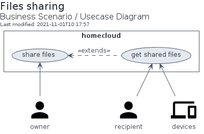

===== Value Stream

[cols="^.^h,3a"]
|===
|Name
h|Share Files
|Description
|The activities involved in selecting and providing shared files hosted on `homecloud`.
|Stakeholder
|The owner of the files.
|Value
|The files are shared abroad the `homecloud` boundaries.
|===

.Business Scenario: Value Stream of Share Files
image::bs-files_sharing-value_stream.png[Business Scenario: Value Stream of Share Files]

.Business Scenario: Value Stream Stages of Share Files
|===
|Value Stream Stage|Description|Participating Stakeholders|Entrance Criteria|Exit Criteria|Value Items

|Select Shared Files
|The act of define which files have to be shared.
|Owner of the files
|Files to share
|Files selected
|Files selected by the user it-self

|Provide Shared Files
|The act of providing the shared files to the targets.
|Owner of the files
|Files selected
|Files shared
|Files ready to be consumed

|Consume Shared Files
|The act of interacting (fetching, streaming, ...) with the shared files.
a|- A Guest
- Owner of the files
- A `homecloud` service
- An External System
|Files shared
|Files consumed
|Files handled by the targets
|===

==== Contacts and Calendars Management

[cols="^.^h,3a"]
|===

|Problem
|With smartphones, it became common to have virtual address books.
Because of convenient, the address books are usually synchronized with a third party solution which, most of the time, is managed by the operating system's owner.
Therefore, a piece of who we are (i.e. who knows who) are stored in the cloud, somewhere in the world, escaping the control of the address book owner.

|Environment
|The synchronization within the local network but also over the Internet.

|Outcomes
|With `homecloud`, address books and other personal calendars are also synchronized but, they are stored locally, under the control of their owners.

|Human Actors
|
- the owner of the personal data

|System Actors
|
- a centralized system hosting and controlling the accesses
- and/or a decentralized system leveraging on a network of peer-to-peer agents distributed on nodes (servers, computers, mobile phones ...)
|===

.Business Scenario: Usecase Diagram of Contacts & Calendars Management
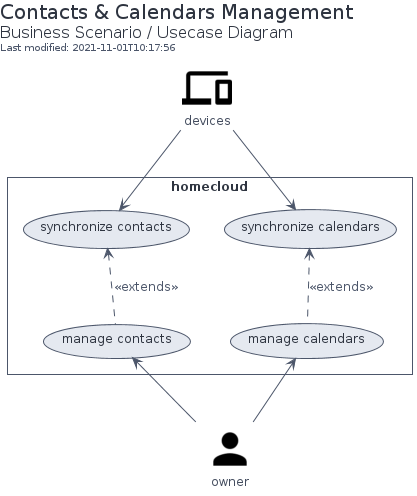

=== Drivers

[cols="^.^h,3a"]
|===
|Privacy
|`homecloud` emerged because of private data concern.
De facto private date are located within the `homecloud` boundaries.

|Flexibility
|A `homecloud` cluster is tailored by the user: the topology of the nodes, their operating systems, the available services, the domain names, passwords ...

|Extensibility
|The platform which supports the out-of-the-box `homecloud` services can also be used for other concerns.

|Elasticity
|`homecloud` resources can be added or removed manually or dynamically.

|Performance
|`homecloud` is not designed for high performances, intensive scaling and so on.
Its main purpose is a _cloud at home_ able to run on a cheap infrastructure.
In deed, the performances are in fact highly related to hardware concerns and so the user decisions.

|Security
|Despite delivered artifacts won't cover all security concerns, configured resources for the platform and services will fulfill the minimum secure practices.
Nevertheless, the flexibility and extensibility of `homecloud` provides to the user ways to define its own level of security.

|Disaster Recovery
|`homecloud` provides services to prevent data loss with backup processes and data replication.

|Observability
|Resources of a `homecloud` cluster can be monitored and observed.
|===

=== Constraints

[cols="^.^h,3a"]
|===
|Target deployment platform
|
- The system must run on development boards at least for production purpose.
- The system must run in virtual environments at least for development and testing purposes.

|Open source
|The system must rely exclusively on open source technologies.
Dispensation can be done when open source alternatives are not available.

|Technology Maturity
|Due to the nature of the initiative, `homecloud` may rely on adventurous solutions.
Nevertheless, when available, matured technologies are emphasis.

|Expected Technologies
|`homecloud` relies on container orchestration to provide some cloud computing architectural artifacts.
The most complete implementation embracing container orchestration is `kubernetes`.
Therefore, the main technology involves in `homecloud` must be `kubernetes`.

|Maintenance
|A `homecloud` cluster must rely on approaches like automation and self-healing to decrease the maintenance activities.
Moreover, a `homecloud` should be easily administrate by a single person.

|Skills
|A `homecloud` cluster cannot be managed by anyone, some skills related to system administration, container orchestration ... are expected.
|===

=== Principles

[cols="^.^h,3a"]
|===
|Name
h|Separation of Services and Platform
|Statement
|The services should not be tightly coupled to the `homecloud` platform.
|Rationale
|With a loose coupling approach between the platform and the services, each side can have its own lifecycle.
Moreover, services provided by external sources can also be easily integrated.
|Implications
|`homecloud` provides must provide two main deliverables:

- resources to bootstrap and maintain the platform
- resources to install and maintain the built-in services

Moreover, each deliverable can be implemented separately with different paces of development or technologies.
|===

[cols="^.^h,3a"]
|===
|Name
h|Convergence of Centralization and Decentralization
|Statement
|Services provided by `homecloud ` should embrace both organizational structures centralized and decentralized.
|Rationale
|Some services, especially those leveraging on files, can be handled from a centralized (e.g. a client/server relationship) or decentralized (e.g. a peer to peer network) approach.
The best approach depends on the context of the usage.
That why, as long as it is possible, the built-in services of `homecloud` should embrace both organizational structures.
|Implications
|The solutions which embrace both organizational structures, especially those working on files, have to be carefully implemented to avoid conflict and data loss.
|===

=== Requirements

==== Centralized Synchronization

[cols="^.^h,3a"]
|===
|Statement
|The system must provide a service to synchronize files between a client and a server.
|Rational
|The requirement is expected by use cases.
|Use Cases
|- Synchronize Photos
- Synchronize Files
|Principles
|- Centralized approach
|Specification
|- The synchronization should leverage on the WebDav protocol.
- The synchronization can be handled by a non-standard solution.
- The synchronized content must be readable and mutable by a decentralized solution.
|===

[cols="^.^h,3a"]
|===
|Statement
|The system must provide a service to synchronize contacts between a client and a server.
|Rational
|The requirement is expected by use cases.
|Use Cases
|- Synchronize Contacts
|Principles
|- Centralized approach
|Specification
|- The synchronization should leverage on the CardDav protocol.
- The synchronization can be handled by a non-standard solution.
|===

[cols="^.^h,3a"]
|===
|Statement
|The system must provide a service to synchronize calendars between a client and a server.
|Rational
|The requirement is expected by use cases.
|Use Cases
|- Synchronize Calendars
|Principles
|- Centralized approach
|Specification
|- The synchronization should leverage on the CalDav protocol.
- The synchronization can be handled by a non-standard solution.
|===

==== Decentralized Synchronization

[cols="^.^h,3a"]
|===
|Statement
|The system must provide a service to synchronize files between peers.
|Rational
|The requirement is expected by use cases.
|Use Cases
|- Synchronize Photos
- Synchronize Files
|Principles
|- Decentralized approach
|Specification
|- The synchronization can be handled by a non-standard solution.
|===

[cols="^.^h,3a"]
|===
|Statement
|The system must provide a service to synchronize contacts between peers.
|Rational
|The requirement is expected by use cases.
|Use Cases
|- Synchronize Contacts
|Principles
|- Decentralized approach
|Specification
|- The synchronization should leverage on the vCard format.
- The synchronization can be handled by a non-standard solution.
|===

[cols="^.^h,3a"]
|===
|Statement
|The system must provide a service to synchronize calendars between peers.
|Rational
|The requirement is expected by use cases.
|Use Cases
|- Synchronize Calendars
|Principles
|- Decentralized approach
|Specification
|- The synchronization should leverage on the iCalendar format.
- The synchronization can be handled by a non-standard solution.
|===

==== Sharing

[cols="^.^h,3a"]
|===
|Statement
|The system must provide a service to share files to external systems.
|Rational
|The requirement is expected by use cases.
|Use Cases
|- Share Photos
- Share Files
|Principles
|- Centralized approach
|Specification
|- The following protocols must be supported: CIFS, NFS and WebDav.
|===

[cols="^.^h,3a"]
|===
|Statement
|The system must provide a service to share files to guest.
|Rational
|The requirement is expected by use cases.
|Use Cases
|- Share Photos
- Share Files
|Principles
|- Centralized approach
|Specification
|- A User Interface must be available to create the share.
- A User Interface must be available to provide the shared content to the guest.
|===

==== Non-Functional

[cols="^.^h,3a"]
|===
|Statement
|The system must provide a service to back up and restore data managed by other `homecloud` services.
|Rational
|The requirement is expected to meet drivers.
|Drivers
|- Disaster Recovery
|Specification
|- The solution should be a "native" feature of the main platform technology.
|===

[cols="^.^h,3a"]
|===
|Statement
|The system must provide a service to observe the `homecloud` resources.
|Rational
|The requirement is expected to meet drivers.
|Drivers
|- Observability
|Specification
|- The solution may store data.
- The solution must provide a user interface.
|===

=== Work Packages

`homecloud` leverages on three main work packages.
The first one, the _Platform_, provides support for the two other ones.
The second one, the _Decentralized NAS_, is a regular centralized <<g_nas, NAS>> dedicated to store the private photos and files.
However, a peer-to-peer system is plugged to it, so that replication can also be handled with a decentralized approach.
Finally, the _Services_, relies on the _Decentralized NAS_ to manage its content and to provide the remaining services: contacts management, files sharing ...

.Vision: Component Diagram of the Work Packages
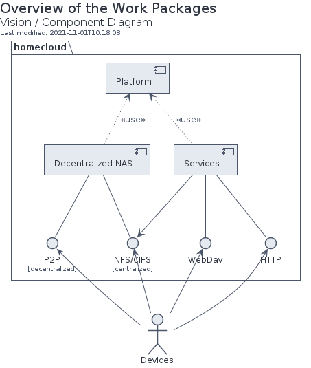

== The Platform

=== The hosting strategies

To properly operate services, `homecloud` leverages on two hosting strategies: containerized workloads and container orchestration.

The first strategy, the containerized workload (i.e. the <<g_containerization, containerization>>), provides many benefits about the packaging, distribution and usage of the services them-self <<rhc>>.

The key characteristics are:

* Portability: a container can be easily deployed in a container environment whatever the host's operating system within the respect of the container's and host's architecture.
* Configurability: a container can be easily configured about its infrastructure (cpu, memory ...) but also about the underlying workload (overriding containerized file or environment variables).
* Isolation: a container cannot exceed its infrastructure limit and so cannot impact sibling running containers.
* Efficient disk usage: a containerized workload needs less disk usage than virtualized one.

The second one, the container orchestration, provides also many benefits about the overall handling of containerized workloads <<rhco>>.

The key characteristics are:

* Automatic deployments: a container orchestrator manages it-self the deployment process of containerized workloads across the nodes.
* Container management: a container orchestrator provides services to monitor and interact with containerized workloads deployed among the cluster nodes.
* Resource allocation: a container orchestrator monitors and manages the resources to satisfy the requirements of the deployed containerized workloads.
* Networking configuration: a container orchestrator manages it-self the networking configuration to provide isolation and/or inter-connection between containerized workloads according to their needs.

However, a couple of hosting strategies are not enough to provide an efficient platform.
Some pieces are still missing: a set of building blocks able to support the services embracing the hosting strategies.

=== The container engine and orchestrator

The containerization of workloads as well as their management are handled by many technologies.
Nevertheless, an effort of standardization emerged from the industry which led to the creation of the Cloud Native Computing Foundation (CNCF) <<cncf>>.
The CNCF hosts many components, some of them are the first building blocks of the `homecloud` stack.

The first one is `containerd` <<cntd>>. It's the container engine which handles the containerization of workloads.
The second one is `kubernetes` <<k8s>>. It's the container orchestrator managing the cluster of `containerd` instances.
Finally, the last one is `k3s` <<k3s>>. It's a distribution of `kubernetes` dedicated of IoT or other cloudless native environments ... like `homecloud`.

The orchestration of containerized workloads is a good starting point.
However, many other concerns have to be tackled, the next one is about availability.

=== The cluster availability

Basically when a request comes from Internet, the router has to redirect it to the cluster using the <<g_port_forwarding, port forwarding>> technique.
Therefore, the router must be configured with an IP able to handle the forwarded requests.

In the `homecloud` context, the configured IP is one of anyone of the cluster nodes, because Kubernetes is internally able to forward requests to the right node whatever the entry point.

However, IP addresses can be dynamics and moreover the node availability cannot be guarantied.
It means the configured IP could become unallocated in the future in case of dynamic IP, or pointing to a node which stops to work properly.
Therefore, the cluster is not reliable because the cluster is not <<g_ha, highly available>> <<doha>>.

One of the simplest solutions to prevent unavailability of the cluster is to use the virtual server technique <<vswt>>.
That means, from the router point of view, the cluster is in fact just a unique server which can be reached with a unique IP address which will never ever change.

Now the cluster is highly available, the next topic is to be sure the containerized workloads are fully highly available too.

=== The distributed block storage

Deploying a container and providing its high availabilities on a cluster is easy with Kubernetes.
However, it doesn't manage the availability of the container's data among the nodes.

For instance, if a container hosting a database is destroyed and then re-created on a new node by the orchestrator, by default, the new container won't start with the data related to the destroyed one.

In order to get the availability of the data among the nodes of the cluster, a distributed storage system has to be configured.

Now containers are able to recover their data over their lifecycles, there is another topic to deal with: how final services will be found and reached from Internet?

=== The reverse proxy

A <<g_reverse_proxy_server, reverse proxy>> handles the requests coming from the external world and then dispatch them to the internal one.
In the `homecloud` context, the reverse proxy handles the requests coming from Internet and then dispatch them to the containerized workloads.
The handling of incoming requests can be straight forward or much complex: enhancement of requests, security, load balancing ...

Presently, the cluster is able to properly serves services within usual circumstances.
Nevertheless, unexpected events can occur and lead to unavailability of the cluster.
Unavailability is not welcome and another building block should prevent it: the monitoring of the cluster's status and the alerts broadcasting.

=== Monitoring and alerting

[NOTE]
====
[yellow-background]#TODO#
Introduce observability
====

=== Orchestrator management

The management of a Kubernetes cluster can be done using the command line interface provided by `kubectl`.
However, its usage requires access to the terminals of cluster nodes locally or remotely.
Another way is to use a web-app which will be able to directly deals with the Kubernetes API.
So that, the management activities can be done without direct access to the cluster nodes.

The management of the Kubernetes resources cannot resolve all maintenance cases.
The Murphy’s law is too strong, too true.
_Anything that can go wrong will go wrong_, and it could be disaster.
Therefore, another building block has to be defined: the backup and restore.

=== Backup and restore

In the `homecloud` context, the term disaster means: data stored in Ceph have been lost.
For instance, the Nextcloud database cannot be used any more because of data corruption which cannot be resolved by the MariaDB engine it-self.
Therefore, `homecloud` must provide a way <<g_disaster_recovery, to recover the disaster>>.
The most affordable way to recover data is to regularly backup them and storing them in another system.

At this point, all main building blocks have been introduced.
Nevertheless, side concerns have to be yet tackled.

=== Security hardening

A private cloud, 1) hosted on low cost ARM boards, 2) available from a domestic Internet access and, 3) managed with non-professional manners could be a target for external threats.
Therefore, in the `homecloud` context, the best way is, by default, <<g_hardening, to harder>> every thing.

However, the goals of the security hardening subject are wides and sometime not easily reachable.
Could it be possible to easily harden a container image which is built by another entity?
Or to easily harden application configuration without knowing the application it-self?
Is it realistic to adapt the physical installation of a rent house because of security hardening principles?

The present paper doesn't cover the security hardening of the `homecloud` external world: the router, the ethernet/wireless networks, the electromagnetic fields ... <<hwn>>.
It focuses only on the virtual world, i.e. from the operating systems to the applications providing the services.

Resources exist to deal with the security hardening subject in the scope of a cluster of servers.
One of the most popular projects is the DevSec Project <<dsp>>.

=== Infrastructure as code

A `homecloud` cluster can be fully installed manually node by node, task by task, package by package, etc.
However, this approach, even if highly instructive, is time-consuming and error-prone.
In the IT industry there is more efficient way to manage infrastructure stuff: the infrastructure as code <<rhic>>.

It relies on a declarative model stored in a revision control system (e.g. GIT).
The model is then used to drive tools which automate the IT tasks.
So that, processes become a development artifact.
Therefore, to _source code_ of the artifacts can be developed and tested iteratively in virtual environments, especially in a <<g_continuous_integration, continuous integration>> context.

=== Characteristics

.The Platform: The Characteristics Stack
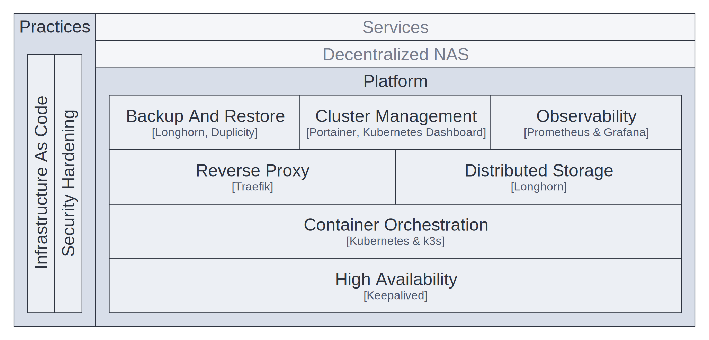

.The Platform: The Characteristics Matrix
[cols="2h,1a,3a"]
|===
|Characteristic |MoSCoW value |Solutions

|Container Orchestration
|Must Have
|- Kubernetes <<k8s>> distributed by k3s <<k3s>>

|Reverse Proxy
|Must Have
|- Traefik <<tra>>

|Infrastructure as code
|Must Have
|- Ansible <<ans>>
- Kustomize <<ktz>>
- Helm <<hlm>>

|High Availability
|Should Have
|- Keepalived <<kad>>

|Distributed Storage
|Should Have
|- Longhorn <<lhn>>

|Backup and Restore
|Should Have
|- Longhorn <<lhn>>
- duplicity <<dup>>

|Security Hardening
|Could Have
|- devsec.hardening <<acsh>>

|Cluster Management
|Could Have
|- Kubernetes Dashboard <<kdb>>
- Portainer <<por>>

|Observability
|Could Have
|- Prometheus <<pmt>> & Grafana  <<grf>>
|===

== Decentralized NAS

The purpose of a Decentralized NAS (also named _dnas_) is to expose private files over the local network like a usual <<g_nas, NAS>> but also from Internet.
Moreover, changes are handled by centralized protocols (e.g. CIFS, NFS) and also decentralized ones (e.g. p2p).

.Decentralized NAS: Context Diagram of Decentralized NAS
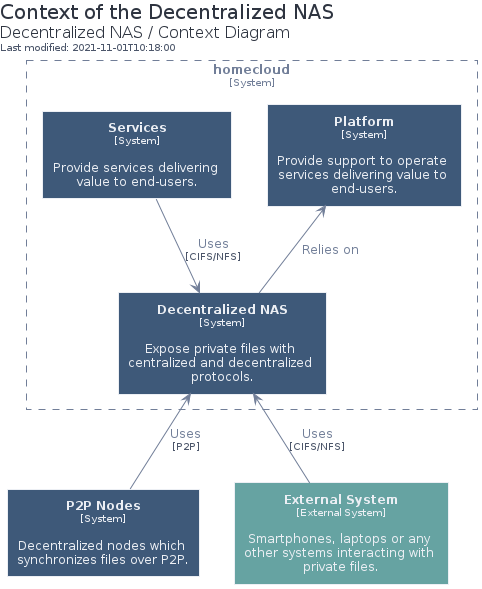

=== Characteristics

.Decentralized NAS: The Characteristics Stack
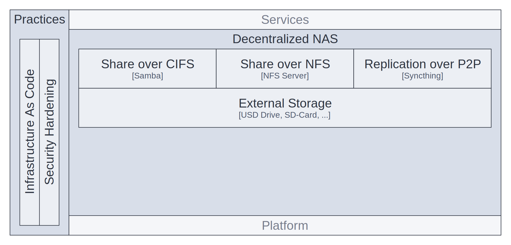

.Decentralized NAS: The Characteristics Matrix
[cols="2h,1a,3a"]
|===
|Characteristic |MoSCoW value |Solutions

|Synchronization over P2P
|Must Have
|Syncthing <<syt>>

|Share over CIFS
|Must Have
|Samba <<smb>>

|Share over NFS
|Must Have
|NFS Server <<nfs>>

|External Storage
|Must Have
|USB Drive, SD-Card, etc.
|===

=== Software Architecture

The solution leverages on three main runtimes:

- a NFS server to serve files over the NFS protocol
- a Samba server to serve files over the CIFS protocol
- a Syncthing instance to handle files replication over a P2P network

All runtimes rely on the same source of truth: a location in the file-system.
The location  can be related to a mount of an external block storage, e.g. USB Drive, SD-Card.

.Decentralized NAS: Container Diagram of Decentralized NAS
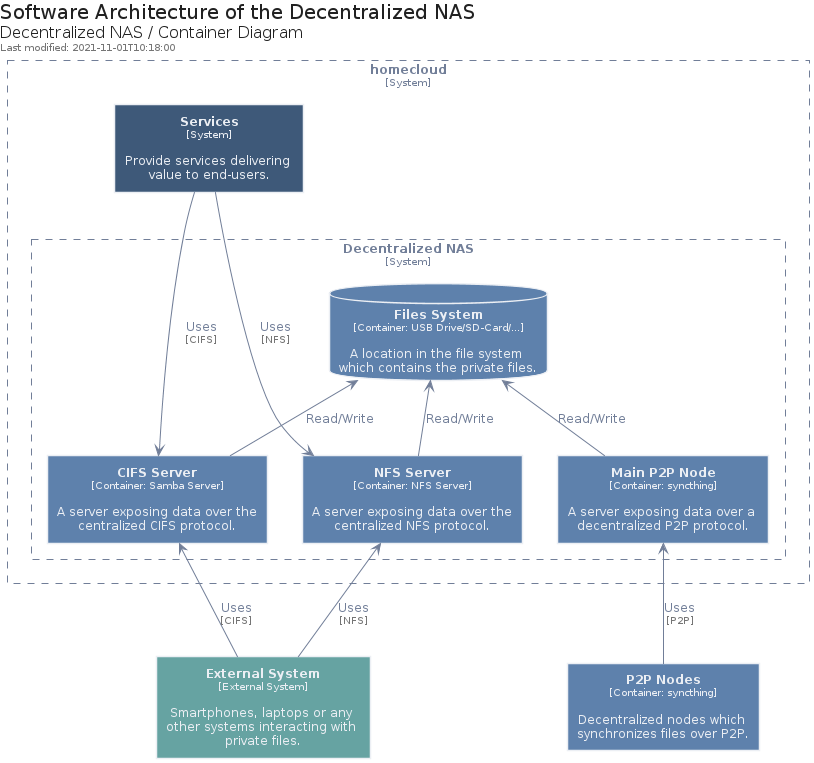

=== Deployment

Syncthing is managed as a regular service of the operating system.
That means, the process has direct accesses to the host resources, especially the network stack.
The CIFS server and Samba are deployed in Kubernetes within the same pod.
Because the three services rely on the same location in the host filesystem, they have to run on the same `homecloud` node, i.e. the same board.

Many instances of Decentralized NAS can co-exist within the same `homecloud` cluster.
In that case, Syncthing is used to synchronized data between them.

.Decentralized NAS: Layout of a dnas node
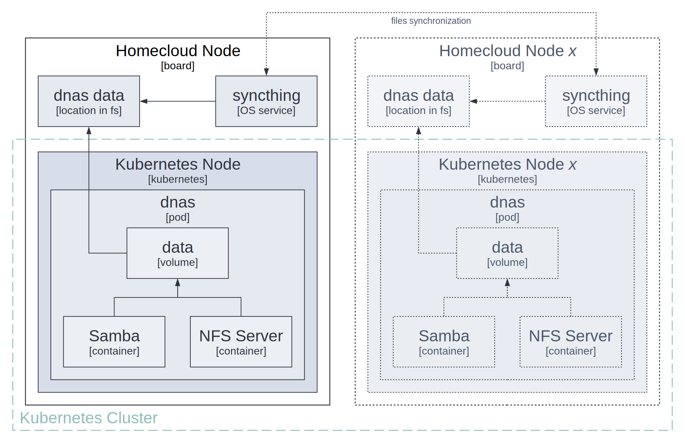

=== Example

In the following example, Decentralized NAS is deployed on two nodes, i.e. two different boards.

_User Phone_ pushes photos to _Node #2_ with its Syncthing application.
The photos are then stored in the _Node #2_ file system and also synchronized with _Node #1_ because of the Syncthing peering.

On _User Laptop_, private documents (spreadsheets, pictures, etc.) are synchronized with _Node #1_ using Syncthing.
Because of the Syncthing peering with _Node #2_, the documents are also replicated there.
Additionally, a _File Navigator_ is connected to the _Samba_ server on _Node #1_, so that photos pushed by _User Phone_ can be locally browsed.
Moreover, downloaded ROMS are pushed to the Decentralized NAS with the same CIFS channel.

Finally, on _Console_, the gaming platform can fetch the ROMs (pushed by _User Laptop_) on the NFS Server of _Node #2_.

.Decentralized NAS: An example of Decentralized NAS usage
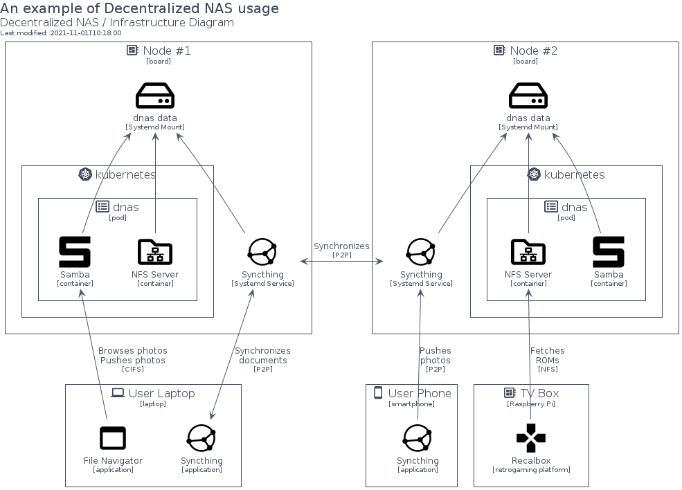

== Services

The purpose of Services is to expose services over the web via front-ends for end users as well as web-services for external systems.

.Services: Context Diagram of Decentralized NAS
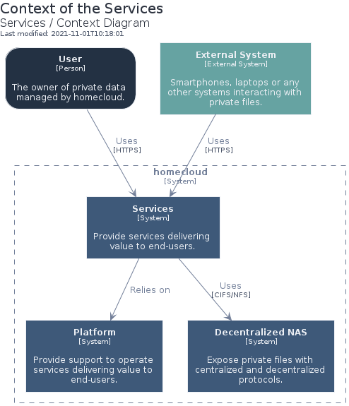

=== Characteristics

Because of its _cloud_ nature, `homecloud` can support many services.
Nevertheless, only those identified within the vision description (c.f. <<Vision>>) will be detailed.

.Services: The Characteristics Stack
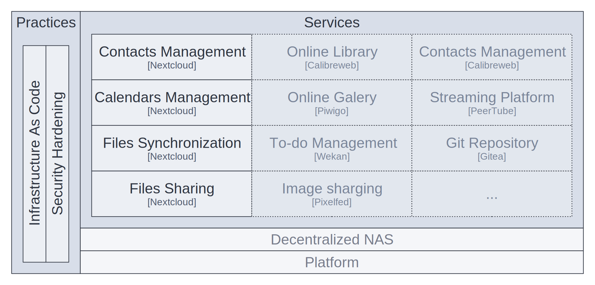

.Services: The Characteristics Matrix
[cols="2h,1a,3a"]
|===
|Characteristic |MoSCoW value |Solutions

|Contacts Management
|Must Have
|Nextcloud <<ncd>>

|Calendars Management
|Must Have
|Nextcloud <<ncd>>

|Files (Photos) Synchronization
|Must Have
|Nextcloud <<ncd>>

|Files Sharing
|Must Have
|Nextcloud <<ncd>>
|===

=== Software Architecture

The solution leverages on only one system, Nextcloud, which is composed of three main runtimes:

- the monolith which handles the requests
- the database which contains the data like users, contacts, ...
- the cache which contains transient data for improvement

Moreover, the solution relies on the Decentralized NAS to have access to private files.
So that, private files can be fetched and mutated from both approaches centralized and decentralized.

.Services: Container Diagram of Services
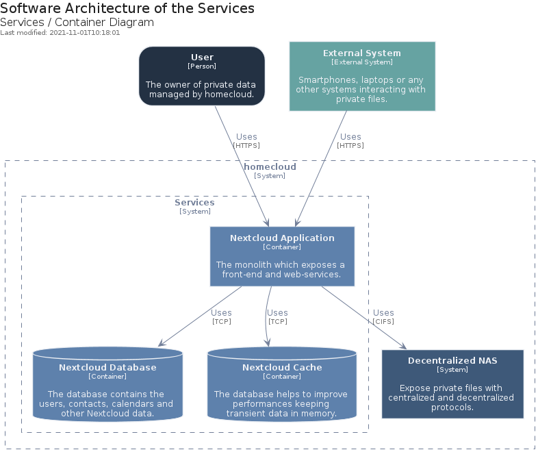

=== Deployment

The Nextcloud system is fully managed by Kubernetes.

.Services: Nextcloud and Kubernetes integration
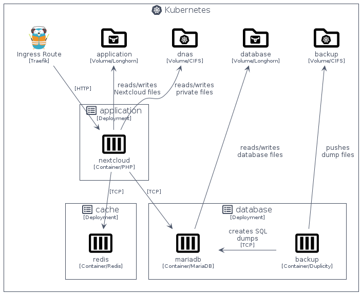

=== Example

The following example shows photos took on _User Phone_ are synchronized _User Phone_

In the following example, the Services is deployed on two nodes, i.e. two different boards.

_User Phone_ pushes photos to _Nextcloud Monolith_ with the local mobile Nexcloud application.
On _Nextcloud Monolith_, the photos are directly written in a CIFS share provided by _Decentralized NAS_.
So that, the photos are stored in the local _dnas data_ drive and then replicated on _Node #2_ over Syncthing.

On _User Laptop_, downloaded ROMS are synchronized with _Node #1_ using the local desktop Nexcloud application.
Like for the photos, the ROMS are store in the local _dnas data_ drive and then replicated on _Node #2_.
The same photos can also be browsed using the front-end of Nextcloud Monolith with an _Internet Navigator_.

Finally, on _Console_, the gaming platform can fetch the ROMs (pushed by _User Laptop_) on the NFS Server of _Node #2_.

.Services: An example of Services usage
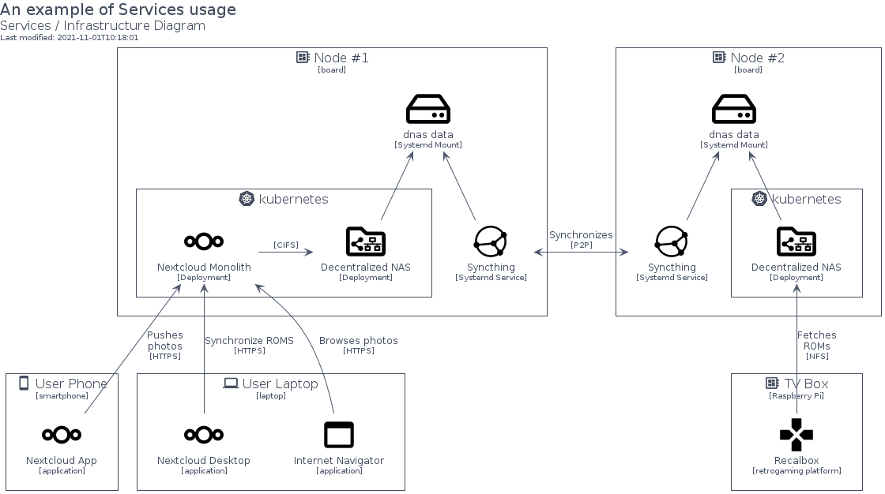

== Deliverables

The `homecloud` work packages are bundled in two main deliverables:

1. an Ansible Collection <<ans>> which implements both work packages the Platform and Decentralized NAS
2. Kustomize Modules <<ktz>> which implements the work package Services

.Deliverables: The Platform Matrix
[cols="h,a,a,a"]
|===
|Solution |Characteristics |Deliverable |Runtime

|devsec.hardening
|- Security Hardening
|Ansible Collection
|Operating System

|Keepalived
|- High Availability
|Ansible Collection
|Operating System

|k3s
|- Container Orchestration
|Ansible Collection
|Operating System

|Traefik
|- Reverse Proxy
|Ansible Collection
|Kubernetes

|Longhorn
|- Distributed Storage
- Backup and Restore
|Ansible Collection
|Kubernetes

|Kubernetes Dashboard
|- Cluster Management
|Ansible Collection
|Kubernetes

|Portainer
|- Cluster Management
|Ansible Collection
|Kubernetes

|Prometheus & Grafana
|- Observability
|Ansible Collection
|Kubernetes
|===

.Deliverables: The Decentralized NAS Matrix
[cols="h,a,a,a"]
|===
|Solution |Characteristics |Deliverable |Runtime
|Syncthing
|- Files Synchronization
|Ansible Collection
|Operating System

|Samba Server
|- Files Sharing
|Ansible Collection
|Kubernetes

|NFS Server
|- Files Sharing
|Ansible Collection
|Kubernetes
|===

.Deliverables: The Services Matrix
[cols="h,a,a,a"]
|===
|Solution |Characteristics |Deliverable |Runtime

|Nextcloud
|- Contacts Management
- Calendars Management
- Photos Synchronization
- Files Synchronization
- Files Sharing
- Backup and Restore (with duplicity)
|Kustomize Module
|Kubernetes
|===

[glossary]
== Glossary

[[g_containerization]]Containerization::
Containerization is a type of virtualization strategy that emerged as an alternative to traditional hypervisor-based virtualization. +
https://www.techopedia.com/definition/31234/containerization-computers

[[g_continuous_integration]]Continuous Integration (CI)::
Continuous integration (CI) is a software development practice in which each member of a development team integrates his work with that produced by others on a continuous basis. +
https://www.techopedia.com/definition/24368/continuous-integration-ci

[[g_disaster_recovery]]Disaster Recovery::
Disaster recovery is a set of policies and procedures which focus on protecting an organization from any significant effects in case of a negative event, which may include cyberattacks, natural disasters or building or device failures. +
https://www.techopedia.com/definition/31989/disaster-recovery

[[g_hardening]]Hardening::
Hardening refers to providing various means of protection in a computer system.
Protection is provided in various layers and is often referred to as defense in depth. +
https://www.techopedia.com/definition/24833/hardening

[[g_ha]]High Availability (HA)::
High availability refers to systems that are durable and likely to operate continuously without failure for a long time. +
https://www.techopedia.com/definition/1021/high-availability-ha

[[g_port_forwarding]]Port Forwarding::
Port forwarding is a networking technique through which a gateway or similar device transmits all incoming communication/traffic of a specific port to the same port on any internal network node. +
https://www.techopedia.com/definition/4057/port-forwarding

[[g_nas]]Network-attached storage (NAS)::
Network attached storage (NAS) is a dedicated server, also referred to as an appliance, used for file storage and sharing.
NAS is a hard drive attached to a network, used for storage and accessed through an assigned network address. +
https://www.techopedia.com/definition/26197/network-attached-storage-nas

[[g_reverse_proxy_server]]Reverse Proxy Server::
A reverse proxy server is a type of proxy server that manages a connection or any specific requests coming from an external network/Internet toward an internal network. +
https://www.techopedia.com/definition/16048/reverse-proxy-server

[bibliography]
== References

*Opinions*

* [[[cpa]]] Contributopia, https://contributopia.org/en
* [[[dgo]]] De-google-ify Internet, https://degooglisons-internet.org/en

*Publication*

* [[[dcc]]] The NIST Definition of Cloud Computing, https://nvlpubs.nist.gov/nistpubs/Legacy/SP/nistspecialpublication800-145.pdf

*Concepts*

* [[[doha]]] What is High Availability?, https://www.digitalocean.com/community/tutorials/what-is-high-availability
* [[[rhco]]] What is container orchestration?, https://www.redhat.com/en/topics/containers/what-is-container-orchestration
* [[[rhc]]] What's a Linux container?, https://www.redhat.com/en/topics/containers/whats-a-linux-container
* [[[rhic]]] What is Infrastructure as Code (IaC)?, https://www.redhat.com/en/topics/automation/what-is-infrastructure-as-code-iac
* [[[vswt]]] What is a virtual server?, http://www.linux-vs.org/whatis.html

*Security Hardening*

* [[[hwn]]] How To Harden Your Home Wireless Network?, https://informationhacker.com/how-to-harden-your-home-wireless-network
* [[[dsp]]] DevSec Project, https://dev-sec.io

*Technologies*

* [[[acsh]]] Ansible Collection - devsec.hardening, https://galaxy.ansible.com/devsec/hardening
* [[[ans]]] Ansible, https://www.ansible.com
* [[[cncf]]] Cloud Native Computing Foundation, https://www.cncf.io
* [[[cntd]]] Containerd, https://containerd.io
* [[[dup]]] duplicity, http://duplicity.nongnu.org
* [[[grf]]] Grafana, https://grafana.com/
* [[[hlm]]] Helm, https://helm.sh
* [[[k3s]]] k3s, https://k3s.io
* [[[k8s]]] Kubernetes, https://kubernetes.io
* [[[kad]]] Keepalived, https://www.keepalived.org
* [[[kdb]]] Kubernetes Dashboard, https://github.com/kubernetes/dashboard
* [[[ktz]]] Kustomize, https://kustomize.io
* [[[lhn]]] Longhorn, https://longhorn.io
* [[[ncd]]] Nextcloud, https://nextcloud.com
* [[[nfs]]] Network File System, https://tools.ietf.org/html/rfc5661
* [[[pmt]]] Prometheus, https://prometheus.io
* [[[por]]] Portainer, https://www.portainer.io
* [[[smb]]] Samba, https://www.samba.org
* [[[syt]]] Syncthing, https://syncthing.net
* [[[tra]]] Traefik, https://traefik.io
