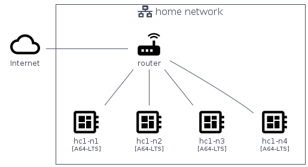
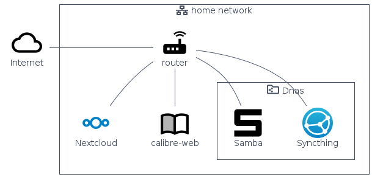
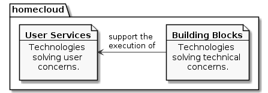
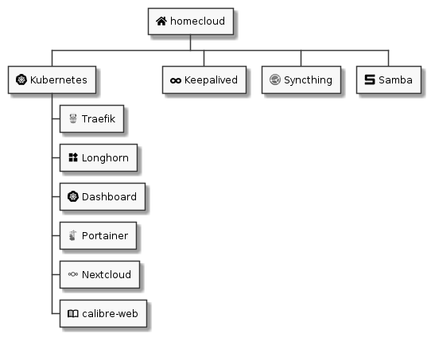
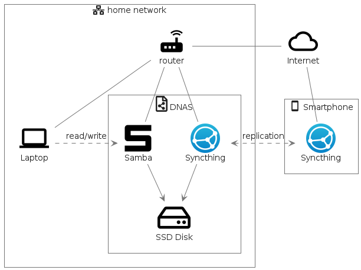
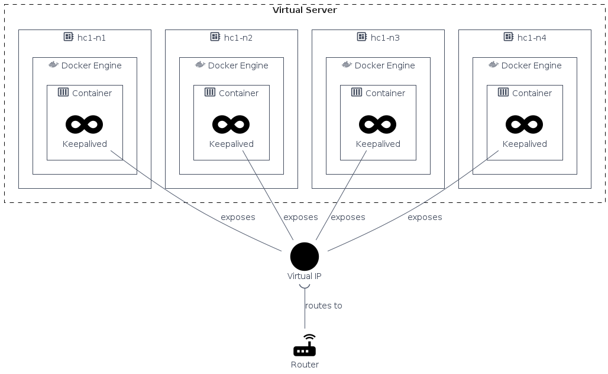

= homecloud : a cloud at home with Kubernetes and Syncthing
// METADATA
:doctype: article
:author: Thibault Morin
:revdate: 2021-03-11
:homepage: https://github.com/tmorin/homecloud-ansible
:toc:
// FOOTNOTES
:fn-p64_disclamer: footnote:[The author, Thibault Morin, declares that there is no conflict of interest with PINE64. Thibault Morin is just a regular consumer of PINE64 products.]
:fn-dmz_skipped: footnote:[To reduce the complexity of the diagram, the demilitarized zone of the home network is skipped.]

== Introduction

`homecloud` aims to provide a <<g_cloud_computing, cloud like environment>>, especially an <<g_internal_cloud, internal cloud>>, at home.
The underlying infrastructure is primarily based on low cost ARM boards, like Raspberry Pi, and powered by open source solutions like Kubernetes or Syncthing.

The main artifact is an Ansible <<ans>> collection designed to bootstrap a ready to use cloud like environment as well as a couple of end-users services.

== The original use case

The intentions which led to the `homecloud` creation match ones related to the Framasoft initiative: De-google-ify Internet <<dgo>>; and its following one: Contributopia <<cpa>>.

Therefore, the original use case is:

* be able to host all services which care about private data: contacts, calendars, mobile pictures, private chats, private projects, ...
* ba able to manage a human size of users, basically a family.

Because big names of cloud computing are de facto discarded, the most affordable solution is to host all those services in a <<g_cluster, cluster>> of low cost ARM boards, especially at home.

Nevertheless, many other use cases could match the need of a self-hosted cluster, of low cost ARM boards, which provides the principal characteristics of cloud computing.

== The original cluster layout

Originally{fn-p64_disclamer}, the cluster was composed of four ARM boards manufactured by PINE64 <<p64>>.
However, there are no constraints about the number of nodes.
A `homecloud` cluster can be composed of one or many nodes.

.The original cluster layout

The four boards are inter-connected using the home's router which is already connected to internet{fn-dmz_skipped}.
Each node is a PINE A64-LTS board <<plts>> embedding an `aarch64` CPU and 2G of memory.
The used operating system is based on Debian: Armbian <<abn>>.

== The user services

The primarily purpose of the cluster is to host the following user services:

* Nextcloud: a suite of client-server software for creating and using file hosting services <<ncd>>.
* calibre-web: a webapp for browsing, reading and downloading eBooks stored in a Calibre database <<caw>>.
* dnas: a decentralized NAS (c.f. appendix <<appendix_dnas>>) based on:
** Syncthing: a free, open-source peer-to-peer file synchronization application <<syt>>.
** Samba: the standard Windows interoperability suite of programs for Linux and Unix <<smb>>.

.The provided user services of the cluster

The Nextcloud and calibre-web can fetch data from the Samba share as any other compatible clients within the home network.

However, to properly operate the above listed services, two hosting strategies are highly emphasis: containerized workloads and container orchestration.

== The hosting strategies

The first strategy, the containerized workload (i.e. the <<g_containerization, containerization>>), provides many benefits about the packaging, distribution and usage of the services them-self <<rhc>>.

The key characteristics are:

* Portability : a container can be easily deployed in a container environment whatever the host's operating system within the respect of the container's and host's architecture.
* Configurability : a container can be easily configured about its infrastructure (cpu, memory ...) but also about the underlying workload (overriding containerized file or environment variables).
* Isolation : a container cannot exceed its infrastructure limit and so cannot impact sibling running containers.
* Efficient disk usage : a containerized workload needs less disk usage than virtualized one.

The second one, the container orchestration, provides also many benefits about the overall handling of containerized workloads <<rhco>>.

The key characteristics are:

* Automatic deployments : a container orchestrator manages it-self the deployment process of containerized workloads across the nodes.
* Container management : a container orchestrator provides services to monitor and interact with containerized workloads deployed among the cluster nodes.
* Resource allocation : a container orchestrator monitors and manages the resources to satisfy the requirements of the deployed containerized workloads.
* Networking configuration : a container orchestrator manages it-self the networking configuration to provide isolation and/or inter-connection between containerized workloads according to their needs.

However, a wish list of services, and a couple of hosting strategies are not enough to provide an efficient cluster.
Some pieces are still missing: a set of building blocks able to support the services embracing the hosting strategies.

== The building blocks

The purpose of the building blocks is to support the execution of the user services.
Some building blocks are parts of the virtual world whereas others to the physical one.

.User Services and Building Blocks

=== The container engine and orchestrator

[NOTE]
====
[yellow-background]#TODO#

Introduce the following items:

- containerd
- kubernetes
- k3s
====

=== The cluster availability

Basically when a request comes from Internet, the router has to redirect it to the cluster using the <<g_port_forwarding, port forwarding>> technique.
Therefore, the router must be configured with an IP able to handle the forwarded requests.

In the `homecloud` context, the configured IP is one of anyone of the cluster nodes, because Kubernetes is internally able to forward requests to the right node whatever the entry point.

However, IP addresses can be dynamics and moreover the node availability cannot be guarantied.
It means the configured IP could become unallocated in the future in case of dynamic IP, or pointing to a node which stops to work properly.
Therefore, the cluster is not reliable because the cluster is not <<g_ha, highly available>> <<doha>>.

One of the simplest solutions to prevent unavailability of the cluster is to use the virtual server technique <<vswt>>.
That means, from the router point of view, the cluster is in fact just a unique server which can be reached with a unique IP address which will never ever change.

Keepalived is one of the most popular implementations of the virtual server technique <<kad>>.
An overview of the Keepalived integration is available in the appendix: <<appendix_keepalived_integration>>.

Now the cluster is highly available, the next topic is to be sure the containerized workloads are fully highly available too.

=== The distributed block storage

Deploying a container and providing its high availabilities on a cluster is easy with Kubernetes.
However, it doesn't manage the availability of the container's data among the nodes.

For instance, if a container hosting a database is destroyed and then re-created on a new node by the orchestrator, by default, the new container won't start with the data related to the destroyed one.

In order to get the availability of the data among the nodes of the cluster, a distributed storage system has to be configured.

Kubernetes and its ecosystem provide many solutions which solve the availability issue of the data among the nodes.
One of them, the lighter on, is Longhorn <<lhn>>.

Now containers are able to recover their data over their lifecycles, there is another topic to deal with: how final services will be found and reached from Internet?

=== The reverse proxy

A <<g_reverse_proxy_server, reverse proxy>> handles the requests coming from the external world and then dispatch them to the internal one.
In the `homecloud` context, the reverse proxy handles the requests coming from Internet and then dispatch them to the containerized workloads.
The handling of incoming requests can be straight forward or much complex: enhancement of requests, security, load balancing ...

Traefik is one of the most popular technology about reverse proxy <<tra>>.
Moreover, it can be easily integrated in Kubernetes.

Presently, the cluster is able to properly serves services within usual circumstances.
Nevertheless, unexpected events can occur and lead to unavailability of the cluster.
Unavailability is not welcome and another building block should prevent it: the monitoring of the cluster's status and the alerts broadcasting.

=== Monitoring and alerting

[NOTE]
====
[yellow-background]#TODO#

Introduce the following items:

- prometheus <<pmt>>
- graphana <<pmt>>
====

=== Orchestrator management

The management of a Kubernetes cluster can be done using the command line interface provided by `kubectl`.
However, its usage requires access to the terminals of cluster nodes locally or remotely.
Another way is to use a web-app which will be able to directly deals with the Kubernetes API.
So that, the management activities can be done without direct access to the cluster nodes.

Portainer is one of the lighter solutions to manage Kubernetes clusters from a web-app <<por>>.
Moreover, it provides natively the support of Kubernetes for the expected architectures.

The management of the Kubernetes resources cannot resolve all maintenance cases.
The Murphy’s law is too strong, too true.
_Anything that can go wrong will go wrong_, and it could be disaster.
Therefore, a final building block has to be defined: the backup and restore.

=== Backup and restore

In the `homecloud` context, the term disaster means: data stored in Ceph have been lost.
For instance, the Nextcloud database cannot be used any more because of data corruption which cannot be resolved by the MariaDB engine it-self.
Therefore, `homecloud` must provide a way <<g_disaster_recovery, to recover the disaster>>.
The most affordable way to recover data is to regularly backup them and storing them into another system.

Longhorn provides a built-in feature to backup blocks on external system.

[NOTE]
====
[yellow-background]#TODO#

Introduce Duplicity <<dup>>.

- backup + restore of specific directories/files
- large set of destinations like SFTP, AWS S3, Google Drive, ...
====

At this point, all building blocks have been introduced, it's time to summarize the cluster's components.

== The components overview

All `homecloud` services and building blocks, can be breakdown in two categories:

1. services managed by Operating System
2. services managed by Kubernetes

.The components hierarchy

Running a highly available cluster able to provide services to end users within isolated execution contexts and, moreover, protected by a modern reverse proxy from Internet accesses is good.
However, it doesn't mean the cluster is secured against external threats ...

== Security Hardening

An internal cloud, 1) hosted on low cost ARM boards, 2) available from a domestic Internet access and, 3) managed with non-professional manners could be a target for external threats.
Therefore, in the `homecloud` context, the best way is, by default, <<g_hardening, to harder>> every thing.

However, the goals of the security hardening subject are wides and sometime not easily reachable.
Could it be possible to easily harden a container image which is built by another entity?
Or to easily harden application configuration without knowing the application it-self?
Is it realistic to adapt the physical installation of a rent house because of security hardening principles?

The present paper doesn't cover the security hardening of the `homecloud` external world: the router, the ethernet/wireless networks, the electromagnetic fields ... <<hwn>>.
It focuses only on the virtual world, i.e. from the operating systems to the applications providing the services.

Resources exist to deal with the security hardening subject in the scope of a cluster of servers.
One of the most popular projects is the DevSec Project <<dsp>>.
It covers two hardening area with the Ansible collection `devsec.hardening` <<acsh>> :

* the operating system GNU/Linux
* the SSH configuration

== Infrastructure as code

A `homecloud` cluster can be fully installed manually node by node, task by task, package by package ...
However, this approach, even if highly instructive, is time-consuming and error prone.
In the IT industry there is more efficient way to manage infrastructure stuff: the infrastructure as code <<rhic>>.

There are many solutions which embraces infrastructure as code.
One of the most popular one is Ansible.
It is an open source tool to automate IT tasks with a declarative model.
Ansible projects can be stored in a Version Control System but also easily tested in virtual environments, especially in a <<g_continuous_integration, continuous integration>> process.

== The Ansible collection

An Ansible collection is mainly composed of Ansible Roles.
A role helps to bundle resources like variables, tasks or templates.
The purpose of a role is to mutate the state of a system (i.e. a host): change file content, install packages, execute command, etc.
Ansible Roles are usually executed in Ansible Playbook.
An Ansible Playbook helps to orchestrate roles according to an inventory of hosts.
In the `homecloud` context, the inventory describes the nodes of the cluster.

The purpose of the `homecloud` Ansible Collection is to provide a set of Roles as well as a set of Playbooks helping to bootstrap the main building blocks of an internal cloud.

=== The customization of Armbian images

In order to mutate a host using <<g_ssh, SSH>>, Ansible expects a location (e.g. its IP), and a remote user properly configured.
According to the original cluster layout, it means each node of the cluster must be manually configured before to execute the playbooks of the `homecloud` collection.

In fact, Armbian is by default configured to get an IP by <<g_dhcp, DHCP>> and to configure users at the first boot.
Therefore, to save time, it is better to implement an Ansible role able to generate a customized `.img` file per cluster node.
So that, a static IP and a proper user can be configured automatically for each cluster node.
The last remaining action is to manually writes the `.img` file on the respective eMMC or SD-Card.

The Ansible role `image_armbian` manages the whole processing:

* download the `.img` files
* for each node patch a dedicated `.img` file

=== The common configurations

Some configurations have to be applied to all nodes of the cluster.
They deal with hostnames, memory management or even package management.
It is the purpose of the Ansible role `cluster_node`.

Basically, all nodes should know the hostname of all cluster nodes.

About memory, Armbian enables by default <<g_memory_swapping, memory swapping>>.
However, its usage on ARM boards leads to poor performances.
Therefore, the Swap must be disabled on each node of the cluster.

Finally, it can be necessary to freeze packages.
For instance, the PINE A64-LTS cannot work with eMMC on recent Linux releases.
Therefore, the respective packages have to be frozen otherwise the system couldn't restart.

[#role_k3s_service]
=== The k3s service

The k3s service is one of the main building block of `homecloud`.
The service must be available on each host of the cluster.
It installs and configures Kubernetes.
The Ansible role `service_k3s` configures the hosts accordingly.

According to the k3s terminology, a host can be a server or an agent.
The inventory groups of the hosts define the role.

* `k3s_srv` contains the server nodes.
* `k3s_agt` contains the agent nodes.

=== The Keepalived service

The Ansible role `service_keepalived` installs and configure Keepalived as an operating service on each host of the cluster.

The role configures also the load of the kernel module `ip_vs` on system boot.

=== The dnas service

The Ansible role `service_dnas` installs and configures Syncthing, Samba and NFS on the host.
It manages the mount of the block device which contains the files to expose over Syncthing and Samba.
It manages also basic configuration of Syncthing and Samba related to credentials.

=== The Kubernetes deployment manifests

There is a dedicated Ansible role by manifests.
Each role provides the definition of the manifest as well as its deployment process.

The building blocks:

* `k3s_dashboard` deploys the Kubernetes Dashboard.
* `k3s_longhorn` deploys the distributed block storage system: Longhorn.
* `k3s_traefik` deploys the ingress controller: Traefik.

The end-user services

* `k3s_calibreweb` deploys calibre-web.
* `k3s_nextcloud` deploys Nextcloud.

=== The Ansible inventory

The inventory defines the nodes of the `homecloud` cluster according to their purposes.

.The hierarchy of the inventory groups
[source,text]
....
all
  boards
    pine64
    ...
  k3s
    k3s_srv
    k3s_agt
  dnas
....

=== The role variables

By convention, the name of the role is the prefix of its variable names.
The convention prevents naming collisions and increase readability of the inventory declarations.

For instance, the path to the block device of an OSD node is defined with a variable name starting with `k3s_traefik` because the variable is only used in the Ansible role `k3s_traefik`: `k3s_traefik_acme_email`.

=== The common variables

Some Ansible roles share the same variables.
In order to avoid confusions, by convention, the prefix of common variables is `homecloud_`.

For instance, the variable `homecloud_virtual_ip` is common because it drives the configuration of Traefik as well as declarations of Keepalived.

== Quality

The good point of the infrastructure as code approach is to provide a source code which can be validated in the continuous integration process.

The validation of the described Ansible collection focuses on two axes.
The first one checks the syntax of the source code in order increase good practices and preventing the bad one.
The second axe checks the implementation performing end-to-end tests.
Those kinds of tests provide two main benefits: 1) the implemented features are tested before to reach the real life and 2) potential regressions are early identified.

For each axe, the Ansible community provides a solution which can be easily integrated in a continuous integration process.

Ansible-lint is the solution to check the syntax <<alt>>.
Fortunately, it is shipped with a large set of rules.

Molecule is the test framework which help to prepare and execute test scenarios with many virtualization providers <<mol>>.
Therefore, the Ansible collection can directly be tested on a virtual server with 1, 2 or more nodes.

== Conclusion

Put all together, the described approaches, concepts and technologies help the design as well as the implementation of an internal cloud.
A kind of cloud able to host private data and provide services all around the world for a reasonable amount of users.

[appendix]
[#appendix_dnas]
== dnas, a decentralized NAS

The purpose of _dnas_ is to expose private files over the local network like a usual <<g_nas, NAS>>  but also from Internet.
Samba provides remote accesses from the local network.
On the other side, Syncthing brings the decentralized part with its peer-to-peer replication protocol over the local network and Internet.

.The dnas overview

The same disk is _opened_ to the internal network as a Samba share.
The Syncthing service replicates data to the external SSD Disk.

[appendix]
[#appendix_keepalived_integration]
== Keepalived integration

For each board, i.e. node of the cluster, the Keepalived application runs as an operating system service.

.Overview of the Keepalived integration

[glossary]
== Glossary

[glossary]
[[g_cloud_computing]]Cloud Computing::
Cloud computing is the use of various services, such as software development platforms, servers, storage and software, over the internet, often referred to as the "cloud." +
https://www.techopedia.com/definition/2/cloud-computing

[[g_cloud_monitoring]]Cloud Monitoring::
Cloud monitoring is the process of reviewing, monitoring and managing the operational workflow and processes within a cloud-based IT asset or infrastructure.
It is the use of manual or automated IT monitoring and management techniques to ensure that a cloud infrastructure or platform performs optimally. +
https://www.techopedia.com/definition/29862/cloud-monitoring

[[g_containerization]]Containerization::
Containerization is a type of virtualization strategy that emerged as an alternative to traditional hypervisor-based virtualization. +
https://www.techopedia.com/definition/31234/containerization-computers

[[g_continuous_integration]]Continuous Integration (CI)::
Continuous integration (CI) is a software development practice in which each member of a development team integrates his work with that produced by others on a continuous basis. +
https://www.techopedia.com/definition/24368/continuous-integration-ci

[[g_cluster]]Cluster::
A cluster, in the context of servers, is a group of computers that are connected with each other and operate closely to act as a single computer. +
https://www.techopedia.com/definition/997/cluster-servers

[[g_dhcp]]Dynamic Host Configuration Protocol (DHCP)::
Dynamic Host Configuration Protocol (DHCP) is a network management protocol used to dynamically assign an IP address to any new node entering the network.
DHCP permits a node to be configured automatically, thereby avoiding the necessity of involvement by a network administrator. +
https://www.techopedia.com/definition/11337/dynamic-host-configuration-protocol-dhcp

[[g_disaster_recovery]]Disaster Recovery::
Disaster recovery is a set of policies and procedures which focus on protecting an organization from any significant effects in case of a negative event, which may include cyberattacks, natural disasters or building or device failures. +
https://www.techopedia.com/definition/31989/disaster-recovery

[[g_hardening]]Hardening::
Hardening refers to providing various means of protection in a computer system.
Protection is provided in various layers and is often referred to as defense in depth. +
https://www.techopedia.com/definition/24833/hardening

[[g_ha]]High Availability (HA)::
High availability refers to systems that are durable and likely to operate continuously without failure for a long time. +
https://www.techopedia.com/definition/1021/high-availability-ha

[[g_internal_cloud]]Internal Cloud::
An internal cloud is a cloud computing service model implemented within an organization's dedicated resources and infrastructure. +
https://www.techopedia.com/definition/26648/internal-cloud

[[g_memory_swapping]]Memory Swapping::
Memory swapping is a memory reclamation method wherein memory contents not currently in use are swapped to a disk to make the memory available for other applications or processes.
The exact state or "page" of memory is copied to the disk to make the data contiguous and easy to restore later. +
https://www.techopedia.com/definition/30467/memory-swapping

[[g_nas]]Network-attached storage (NAS)::
Network attached storage (NAS) is a dedicated server, also referred to as an appliance, used for file storage and sharing.
NAS is a hard drive attached to a network, used for storage and accessed through an assigned network address. +
https://www.techopedia.com/definition/26197/network-attached-storage-nas

[[g_port_forwarding]]Port Forwarding::
Port forwarding is a networking technique through which a gateway or similar device transmits all incoming communication/traffic of a specific port to the same port on any internal network node. +
https://www.techopedia.com/definition/4057/port-forwarding

[[g_reverse_proxy_server]]Reverse Proxy Server::
A reverse proxy server is a type of proxy server that manages a connection or any specific requests coming from an external network/Internet toward an internal network. +
https://www.techopedia.com/definition/16048/reverse-proxy-server

[[g_ssh]]Secure Shell (SSH)::
SSH is a cryptographic protocol and interface for executing network services, shell services and secure network communication with a remote computer. +
https://www.techopedia.com/definition/4127/secure-shell-ssh

[bibliography]

== References

*Opinions*

* [[[cpa]]] Contributopia, https://contributopia.org/en
* [[[dgo]]] De-google-ify Internet, https://degooglisons-internet.org/en

*Concepts*

* [[[doha]]] What is High Availability?, https://www.digitalocean.com/community/tutorials/what-is-high-availability
* [[[rhco]]] What is container orchestration?, https://www.redhat.com/en/topics/containers/what-is-container-orchestration
* [[[rhc]]] What's a Linux container?, https://www.redhat.com/en/topics/containers/whats-a-linux-container
* [[[rhic]]] What is Infrastructure as Code (IaC)?, https://www.redhat.com/en/topics/automation/what-is-infrastructure-as-code-iac
* [[[vswt]]] What is a virtual server?, http://www.linux-vs.org/whatis.html

*Security Hardening*

* [[[hwn]]] How To Harden Your Home Wireless Network?, https://informationhacker.com/how-to-harden-your-home-wireless-network
* [[[dsp]]] DevSec Project, https://dev-sec.io

*Hardware*

* [[[p64]]] PINE64, https://www.pine64.org
* [[[plts]]] PINE A64-LTS, https://www.pine64.org/devices/single-board-computers/pine-a64-lts

*Technologies*

* [[[abn]]] Armbian, https://www.armbian.com
* [[[acsh]]] Ansible Collection - devsec.hardening, https://galaxy.ansible.com/devsec/hardening
* [[[alt]]] Ansible-lint, https://github.com/ansible-community/ansible-lint
* [[[ans]]] Ansible, https://www.ansible.com
* [[[caw]]] calibre-web https://github.com/janeczku/calibre-web
* [[[cntd]]] Containerd, https://containerd.io
* [[[dup]]] duplicity, http://duplicity.nongnu.org
* [[[kad]]] Keepalived, https://www.keepalived.org
* [[[lhn]]] Longhorn, https://longhorn.io
* [[[mol]]] Molecule, https://github.com/ansible-community/molecule
* [[[ncd]]] Nextcloud, https://nextcloud.com
* [[[nfs]]] Network File System, https://tools.ietf.org/html/rfc5661
* [[[pmt]]] Prometheus, https://prometheus.io
* [[[por]]] Portainer, https://www.portainer.io
* [[[smb]]] Samba, https://www.samba.org
* [[[syt]]] Syncthing, https://syncthing.net
* [[[tra]]] Traefik, https://traefik.io
