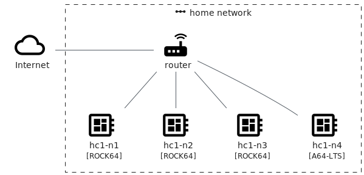
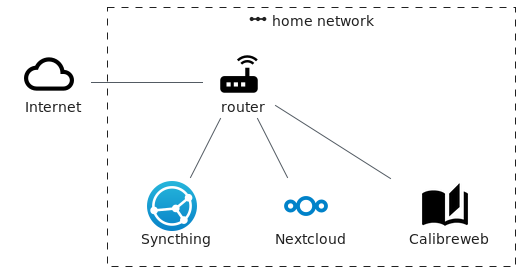

= homecloud : a cloud at home with Docker Swarm, Ceph and Syncthing
// METADATA
:doctype: article
:author: Thibault Morin
:revdate: 2020-11-18
:homepage: https://github.com/tmorin/homecloud-ansible
:toc:
// FOOTNOTES
:fn-p64_disclamer: footnote:[The author, Thibault Morin, declares that there is no conflict of interest with PINE64. Thibault Morin is just a regular consumer of PINE64 products.]
:fn-dmz_skipped: footnote:[To reduce the complexity of the diagram, the demilitarized zone of the home network is skipped.]

== Introduction

`homecloud` aims to provide a _cloud like_ <<cld>> at home, primarily hosted on ARM boards like Raspberry Pi and based on Docker Swarm, Ceph and Syncthing.

The main artifact is an Ansible <<ans>> collection designed to bootstrap a ready to use _cloud like_ environment.

== The original use case

The intentions which led to the `homecloud` creation match ones related to the Framasoft initiative: De-google-ify Internet <<dgo>>; and its following one: Contributopia <<cpa>>.

Therefore, the original use case is:

- be able to host all services which care about private data: contacts, calendars, mobile pictures, private chats, personal projects, ...
- ba able to manage a human size of users, basically a family.

Because big names of cloud computing are de facto discarded, the most affordable solution is to host all those services in a cluster of low cost ARM boards, especially at home.

Nevertheless, many other use cases could match the requirement of a self-hosted cluster of low cost ARM boards enabling the principal characteristics of cloud computing.

== The cluster

The `homecloud` cluster is a network of computers, especially servers, which work together in order to provide services to end users available from Internet.

Despite many providers offer ARM boards all around the world, this article focus exclusively{fn-p64_disclamer} on some boards manufactured by PINE64 <<p64>>.

The next parts of this article may refer to the following cluster layout:

|===
|Hostname|Type|Architecture|Memory|Operating System

|hc1-n1
|ROCK64 <<rock>>
|aarch64
|4G
|Armbian

|hc1-n2
|ROCK64 <<rock>>
|aarch64
|4G
|Armbian

|hc1-n3
|ROCK64 <<rock>>
|aarch64
|4G
|Armbian

|hc1-n4
|PINE A64-LTS <<plts>>
|aarch64
|2G
|Armbian
|===

.The hc1 cluster layout

The four boards are inter-connected using the home's router which is already connected to internet{fn-dmz_skipped}.

== The user services

The primarily purpose of the cluster is to host the following user services:

- Nextcloud: a suite of client-server software for creating and using file hosting services <<ncd>>
- calibre-web: a webapp for browsing, reading and downloading eBooks stored in a Calibre database <<caw>>
- Syncthing: a free, open-source peer-to-peer file synchronization application <<syt>>

.The provided user services of the hc1 cluster

However, to properly operate the above listed services, two hosting strategies are highly emphasis: containerized workloads and container orchestration.

== The hosting strategies

The first strategy, the containerized workload (i.e. the famous _containers_), provides many benefits about the packaging, distribution and usage of the services them-self <<rhc>>.

The key characteristics are:

- Portability : a container can be easily deployed in a container environment whatever the host's operating system within the respect of the container's and host's architecture.
- Configurability : a container can be easily configured about its infrastructure (cpu, memory ...) but also about the underlying workload (overriding containerized file or environment variables).
- Isolation : a container cannot exceed its infrastructure limit and so cannot impact sibling running containers.
- Efficient disk usage : a containerized workload needs less disk usage than virtualized one.

The second one, the container orchestration, provides also many benefits about the overall handling of containerized workloads <<rhco>>.

The key characteristics are:

- Automatic deployments : a container orchestrator manages it-self the deployment process of containerized workloads across the nodes.
- Container management : a container orchestrator provides services to monitor and interact with containerized workloads deployed among the cluster nodes.
- Resource allocation : a container orchestrator monitors and manages the resources to satisfy the requirements of the deployed containerized workloads.
- Networking configuration : a container orchestrator manages it-self the networking configuration to provide isolation and/or inter-connection between containerized workloads according to their needs.

However, a wish list of services, and a couple of hosting strategies are not enough to provide an efficient cluster.
Some pieces are still missing: a set of building blocks able to support the services embracing the hosting strategies.

== The building blocks

The purpose of the building blocks is to support the execution of the user services.
Some building blocks are parts of the virtual world whereas others to the physical one.

.User Services and Building Blocks
image::user_services_and_building_blocks.png[User Services and Building Blocks]

=== The container engine and orchestrator

Docker is one of the most popular technology about _container_, and moreover, ready-to-use to almost all architectures <<dok>>.
Therefore, because `homecloud` must be easy to bootstrap and configure for at least `amd64` and `aarch64` architectures, Docker is a good candidate for the container engine.

Luckily Docker shipped a ready-to-use container orchestrator: Docker Swarm <<dsw>>.
Therefore, according to the _domestic_ usage of `homecloud`, Docker Swarm is a good candidate for the container orchestration especially because no overhead will be added to the technical stack.

Nevertheless, additional building blocks have to be added to the virtual stack.

=== High availability

=== The distributed file system

Deploying containers on nodes of a cluster is easy to do with Docker Swarm.
However, it doesn't manage the availability of the containers' data among the node.

For instance, if a container hosting a database is destroyed and then re-created on a new node by the orchestrator, by default, the new container won't start with the data related to the destroyed one.

In order to get the availability of the data among the nodes of the cluster, a distributed file system has to be configured.

Ceph is one of the most popular technology about distributed file system <<cep>>.
Moreover, it can be easily integrated in a Docker environment <<dvc>>.
Therefore, Ceph is a good candidate for the distributed file system.

Now containers are able to recover their data over their lifecycles, there is another topic to deal with: how final services will be found and reached from Internet?

=== The reverse proxy

The purpose of a reverse proxy is to handle the requests coming from the external world.
In the `homecloud` context, the reverse proxy handles the requests coming from Internet.
The handling of incoming requests can be straight forward or much complex: enhancement of requests, security, load balancing ...
At the end, the reverse proxy routes the requests to the right _back end_ located in the internal world.

Traefik is one of the most popular technology about reverse proxy <<tra>>.
Moreover, it can be easily integrated in a Docker environment.
Therefore, Traefik is a good candidate for the reverse proxy.

Well, the cluster is strong enough to serve the user services, nevertheless unexpected events can occur and lead to unavailability of the cluster.
Unavailability are not welcome and another building block should prevent them, monitoring the cluster's status and broadcasting alerts.

=== Monitoring and alerting

The Influxdata stack is one of the most popular technology about monitoring and alerting <<inf>>.
Especially because the Influxdata stack provide all expected components:

- Telegraf: an agent to collect metrics <<ite>>
- InfluxDB: a database to store metrics <<idb>>
- Chronograf: a front-end to render the metrics <<ich>>
- Kapacitor: a data processing engine to detect anomalies and send alerts <<ika>>

Therefore, Influxdata is a good candidate for the monitoring and alerting stack.

=== Container management

- Portainer: monitoring and management of the Docker Swarm <<por>>

[bibliography]
== References

*Opinions*

- [[[dgo]]] De-google-ify Internet, https://degooglisons-internet.org/en
- [[[cpa]]] Contributopia, https://contributopia.org/en

*Concepts*

- [[[cld]]] The NIST Definition of Cloud Computing, https://nvlpubs.nist.gov/nistpubs/Legacy/SP/nistspecialpublication800-145.pdf
- [[[rhco]]] What is container orchestration?, https://www.redhat.com/en/topics/containers/what-is-container-orchestration
- [[[rhc]]] What's a Linux container?, https://www.redhat.com/en/topics/containers/whats-a-linux-container

*Hardware*

- [[[p64]]] PINE64, https://www.pine64.org
- [[[plts]]] PINE A64-LTS, https://www.pine64.org/devices/single-board-computers/pine-a64-lts
- [[[rock]]] ROCK64, https://www.pine64.org/devices/single-board-computers/rock64

*Technologies*

- [[[ans]]] Ansible, https://www.ansible.com
- [[[caw]]] calibre-web https://github.com/janeczku/calibre-web
- [[[cep]]] Ceph, https://ceph.io
- [[[dok]]] Docker, https://www.docker.com
- [[[dsw]]] Docker Swarm, https://docs.docker.com/engine/swarm
- [[[dvc]]] docker-volume-cephfs https://gitlab.com/n0r1sk/docker-volume-cephfs
- [[[ich]]] Chronograf, https://www.influxdata.com/time-series-platform/chronograf
- [[[idb]]] InfluxDB, https://www.influxdata.com/time-series-platform/
- [[[ika]]] Kapacitor, https://www.influxdata.com/time-series-platform/kapacitor
- [[[inf]]] Influxdata, https://www.influxdata.com
- [[[ite]]] Telegraf, https://www.influxdata.com/time-series-platform/telegraf
- [[[ncd]]] Nextcloud, https://nextcloud.com
- [[[por]]] Portainer, https://www.portainer.io
- [[[syt]]] Syncthing, https://syncthing.net
- [[[tra]]] Traefik, https://traefik.io
