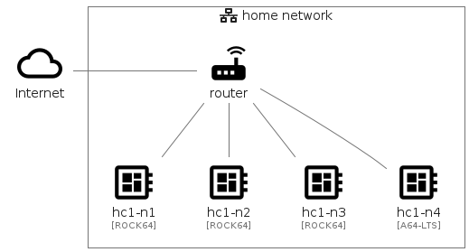
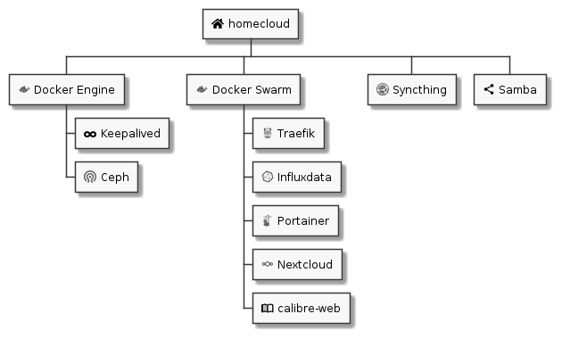

= homecloud : a cloud at home with Docker Swarm, Ceph and Syncthing
// METADATA
:doctype: article
:author: Thibault Morin
:revdate: 2020-11-28
:homepage: https://github.com/tmorin/homecloud-ansible
:toc:
// FOOTNOTES
:fn-p64_disclamer: footnote:[The author, Thibault Morin, declares that there is no conflict of interest with PINE64. Thibault Morin is just a regular consumer of PINE64 products.]
:fn-dmz_skipped: footnote:[To reduce the complexity of the diagram, the demilitarized zone of the home network is skipped.]

== Introduction

`homecloud` aims to provide a <<g_cloud_computing, cloud like environment>>, especially an <<g_internal_cloud, internal cloud>>, at home. The underlying infrastructure is primarily based on low cost ARM boards, like Raspberry Pi, and powered by open source solutions like Docker Swarm, Ceph or Syncthing.

The main artifact is an Ansible <<ans>> collection designed to bootstrap a ready to use cloud like environment as well as a couple of end-users services.

== The original use case

The intentions which led to the `homecloud` creation match ones related to the Framasoft initiative: De-google-ify Internet <<dgo>>; and its following one: Contributopia <<cpa>>.

Therefore, the original use case is:

- be able to host all services which care about private data: contacts, calendars, mobile pictures, private chats, personal projects, ...
- ba able to manage a human size of users, basically a family.

Because big names of cloud computing are de facto discarded, the most affordable solution is to host all those services in a cluster of low cost ARM boards, especially at home.

Nevertheless, many other use cases could match the need of a self-hosted cluster, of low cost ARM boards, which provides the principal characteristics of cloud computing.

== The cluster

The `homecloud` cluster is a network of computers, especially servers, which work together in order to provide services available from Internet, to end users.

Despite many providers offer ARM boards all around the world, this article focus exclusively{fn-p64_disclamer} on some boards manufactured by PINE64 <<p64>>.

The next parts of this article may refer to the following cluster layout.

.The cluster layout

The four boards are inter-connected using the home's router which is already connected to internet{fn-dmz_skipped}.

.Description of the cluster's nodes
|===
|Hostname|Type|Architecture|Memory|Operating System

|hc1-n1
|ROCK64 <<r64>>
|aarch64
|4G
|Armbian

|hc1-n2
|ROCK64 <<r64>>
|aarch64
|4G
|Armbian

|hc1-n3
|ROCK64 <<r64>>
|aarch64
|4G
|Armbian

|hc1-n4
|PINE A64-LTS <<plts>>
|aarch64
|2G
|Armbian
|===

== The user services

The primarily purpose of the cluster is to host the following user services:

- Nextcloud: a suite of client-server software for creating and using file hosting services <<ncd>>.
- calibre-web: a webapp for browsing, reading and downloading eBooks stored in a Calibre database <<caw>>.
- Syncthing: a free, open-source peer-to-peer file synchronization application <<syt>>.
- Samba: the standard Windows interoperability suite of programs for Linux and Unix <<smb>>.

The Syncthing service replicates the data on an external SSD Disk.
The same disk is _opened_ to the internal network as a Samba share.
Therefore, Nextcloud and calibre-web can fetch data from the Samba share as any other compatible clients within the home network.

.The provided user services of the cluster
image::user_services_layout.png[The provided user services of the cluster]

However, to properly operate the above listed services, two hosting strategies are highly emphasis: containerized workloads and container orchestration.

== The hosting strategies

The first strategy, the containerized workload (i.e. the <<g_containerization, containerization>>), provides many benefits about the packaging, distribution and usage of the services them-self <<rhc>>.

The key characteristics are:

- Portability : a container can be easily deployed in a container environment whatever the host's operating system within the respect of the container's and host's architecture.
- Configurability : a container can be easily configured about its infrastructure (cpu, memory ...) but also about the underlying workload (overriding containerized file or environment variables).
- Isolation : a container cannot exceed its infrastructure limit and so cannot impact sibling running containers.
- Efficient disk usage : a containerized workload needs less disk usage than virtualized one.

The second one, the container orchestration, provides also many benefits about the overall handling of containerized workloads <<rhco>>.

The key characteristics are:

- Automatic deployments : a container orchestrator manages it-self the deployment process of containerized workloads across the nodes.
- Container management : a container orchestrator provides services to monitor and interact with containerized workloads deployed among the cluster nodes.
- Resource allocation : a container orchestrator monitors and manages the resources to satisfy the requirements of the deployed containerized workloads.
- Networking configuration : a container orchestrator manages it-self the networking configuration to provide isolation and/or inter-connection between containerized workloads according to their needs.

However, a wish list of services, and a couple of hosting strategies are not enough to provide an efficient cluster.
Some pieces are still missing: a set of building blocks able to support the services embracing the hosting strategies.

== The building blocks

The purpose of the building blocks is to support the execution of the user services.
Some building blocks are parts of the virtual world whereas others to the physical one.

.User Services and Building Blocks

=== The container engine and orchestrator

Docker is one of the most popular technology about _container_, and moreover, ready-to-use to almost all architectures <<dok>>.
Therefore, because `homecloud` must be easy to bootstrap and configure for at least `amd64` and `aarch64` architectures, Docker is a good candidate for the container engine.

Luckily Docker shipped a ready-to-use container orchestrator: Docker Swarm <<dsw>>.applications will be hi
Therefore, according to the _domestic_ usage of `homecloud`, Docker Swarm is a good candidate for the container orchestration especially because no overhead will be added to the technical stack.

Nevertheless, additional building blocks have to be added to the virtual stack.

=== The cluster availability

Basically when a request comes from Internet, the router has to redirect it to the cluster using the <<g_port_forwarding, port forwarding>> technique.
Therefore, the router must be configured with an IP able to handle the forwarded requests.

In the `homecloud` context, the configured IP is one of anyone of the cluster nodes, because Docker Swarm is internally able to forward requests to the right node whatever the entry point <<dnt>>.

However, IP addresses can be dynamics and moreover the node availability cannot be guaranty.
It means the configured IP could become unallocated in the future in case of dynamic IP, or pointing to a node which stops to work properly.
Therefore, the cluster is not reliable because the cluster is not <<g_ha, highly available>> <<doha>>.

One of the simplest solutions to prevent unavailability of the cluster is to use the virtual server technique <<vswt>>.
That means, from the router point of view, the cluster is in fact just a unique server which can be reached with a unique IP address which will never ever change.

Keepalived is one of the most popular implementations of the virtual server technique <<kad>>.
Moreover, it can be easily containerized and configured.
Therefore, Keepalived is a good candidate for the virtual server technique.

An overview of the Keepalived integration is available in the appendix: <<appendix_keepalived_integration>>.

Now the cluster is highly available, the next topic is to be sure the containerized workloads are fully highly available too.

=== The distributed file system

Deploying a container and providing its high availabilities on a cluster is easy with Docker Swarm.
However, it doesn't manage the availability of the container's data among the nodes.

For instance, if a container hosting a database is destroyed and then re-created on a new node by the orchestrator, by default, the new container won't start with the data related to the destroyed one.

In order to get the availability of the data among the nodes of the cluster, a <<g_dfs, distributed file system>> has to be configured.

Ceph is one of the most popular technology about distributed file system <<cep>>.
Moreover, it can be easily integrated in a Docker environment <<dvc>>.
Therefore, Ceph is a good candidate for the distributed file system.

Now containers are able to recover their data over their lifecycles, there is another topic to deal with: how final services will be found and reached from Internet?

=== The reverse proxy

A <<g_reverse_proxy_server, reverse proxy>> handles the requests coming from the external world and then dispatch them to the internal one.
In the `homecloud` context, the reverse proxy handles the requests coming from Internet and then dispatch them to the containerized workloads.
The handling of incoming requests can be straight forward or much complex: enhancement of requests, security, load balancing ...

Traefik is one of the most popular technology about reverse proxy <<tra>>.
Moreover, it can be easily integrated in a Docker environment.
Therefore, Traefik is a good candidate for the reverse proxy.

Presently, the cluster is able to properly serve services within usual circumstances.
Nevertheless, unexpected events can occur and lead to unavailability of the cluster.
Unavailability is not welcome and another building block should prevent it: the monitoring of the cluster's status and the alerts broadcasting.

=== Monitoring and alerting

The Influxdata stack is one of the most popular technology about monitoring and alerting <<inf>>.
Especially because the Influxdata stack provides all expected components:

- Telegraf: an agent to collect metrics <<ite>>
- InfluxDB: a database to store metrics <<idb>>
- Chronograf: a front-end to render the metrics <<ich>>
- Kapacitor: a data processing engine to detect anomalies and send alerts <<ika>>

Therefore, Influxdata is a good candidate for the <<g_cloud_monitoring, cloud monitoring>> stack.

However, once the cloud monitoring stack detects an anomaly and emits an alert, then usually actions have to be executed.
Therefore, another build block has to be defined: the management of the Docker Swarm cluster.

=== Docker Swarm management

The management of a Docker Swarm cluster as well as the related Docker engines, can be done using the command line interface provided by default.
However, its usage requires access to the terminals of cluster nodes.
Another way is to use a web-app connected to a backend which will be able to directly deals with the Docker daemons.
So that, the management activities can be done without direct access to the cluster nodes.

Portainer is one of the most popular solutions to manage Docker Swarm clusters from a web-app <<por>>.
Moreover, it provides natively the support of Docker Swarm for the expected architectures.
Therefore, Portainer is a good candidate for the management of the Docker Swarm cluster.

The management of the Docker resources cannot resolve all maintenance cases.
The Murphy’s law is too strong, too true.
_Anything that can go wrong will go wrong_, and it could be disaster.
Therefore, a final building block has to be defined: the backup and restore.

=== Backup and restore

In the `homecloud` context, the term disaster means: data stored in Ceph have been lost.
For instance, the Nextcloud database cannot be used anymore because of data corruption which cannot be resolved by the MariaDB engine it-self.
Therefore, `homecloud` must provide a way <<g_disaster_recovery, to recover the disaster>>.
The most affordable way to recover data is to regularly backup them and storing them into another system.

Duplicity is one of the most popular tools to create secure backup <<dup>>.
Moreover, Duplicity provides a large set of destinations like SFTP, AWS S3, Google Drive, ...
Obviously, it provides the restoring action too.
Therefore, Duplicity is a good candidate to execute the backup and restore processes.

At this point, all building blocks have been introduced, it's time to summarize the cluster's components.

== The components overview

All `homecloud` services and building blocks, can be breakdown in three categories:

1. services of Operating System
2. orphan Docker containers
3. stacks of Docker Swarm

.The components hierarchy

Running a highly available cluster able to provide services to end users within isolated execution contexts and, moreover, protected by a modern reverse proxy from Internet accesses is good.
However, it doesn't mean the cluster is secured against external threats ...

== Security Hardening

An internal cloud, 1) hosted on low cost ARM boards, 2) available from a domestic Internet access and, 3) managed with non-professional manners could be a target for external threats.
Therefore, in the `homecloud` context, the best way is, by default, <<g_hardening, to harder>> every thing.

However, the goals of the security hardening subject are wides and sometime not easily reachable.
Could it be possible to easily harden a container image which is built by another entity?
Or to easily harden application configuration without knowing the application it-self?
Is it realistic to adapt the physical installation of a rent house because of security hardening principles?

The present paper doesn't cover the security hardening of the `homecloud` external world: the router, the ethernet/wireless networks, the electromagnetic fields ... <<hwn>>.
It focuses only on the virtual world, i.e. from the operating systems to the applications providing the services.

Resources exist to deal with the security hardening subject in the scope of a cluster of servers.
One of the most popular projects is the DevSec Project <<dsp>>.
It covers two hardening area with the Ansible collection `devsec.hardening` <<acsh>> :

- the operating system GNU/Linux
- the SSH configuration

[appendix]
[#appendix_keepalived_integration]
== Keepalived integration

For each board, i.e. node of the cluster, the Keepalived application runs in a Docker Container which is executed in the Docker Engine.
The execution requires the _privileged_ flag, and the capability _NET_ADMIN_.
Therefore, each Keepalived instance can manage the virtual network interface of the virtual IP.

.Overview of the Keepalived integration
image::building_blocks_keepalived.png[Overview of the Keepalived integration]

[glossary]
== Glossary

[glossary]
[[g_cloud_computing]]Cloud Computing::
Cloud computing is the the use of various services, such as software development platforms, servers, storage and software, over the internet, often referred to as the "cloud." +
https://www.techopedia.com/definition/2/cloud-computing
[[g_cloud_monitoring]]Cloud Monitoring::
Cloud monitoring is the process of reviewing, monitoring and managing the operational workflow and processes within a cloud-based IT asset or infrastructure. It is the use of manual or automated IT monitoring and management techniques to ensure that a cloud infrastructure or platform performs optimally. +
https://www.techopedia.com/definition/29862/cloud-monitoring
[[g_containerization]]Containerization::
Containerization is a type of virtualization strategy that emerged as an alternative to traditional hypervisor-based virtualization. +
https://www.techopedia.com/definition/31234/containerization-computers
[[g_dfs]]Distributed File System (DFS)::
A distributed file system (DFS) is a file system with data stored on a server. The data is accessed and processed as if it was stored on the local client machine. +
https://www.techopedia.com/definition/1825/distributed-file-system-dfs
[[g_disaster_recovery]]Disaster Recovery::
Disaster recovery is a set of policies and procedures which focus on protecting an organization from any significant effects in case of a negative event, which may include cyberattacks, natural disasters or building or device failures. +
https://www.techopedia.com/definition/31989/disaster-recovery
[[g_hardening]]Hardening::
Hardening refers to providing various means of protection in a computer system. Protection is provided in various layers and is often referred to as defense in depth. +
https://www.techopedia.com/definition/24833/hardening
[[g_ha]]High Availability (HA)::
High availability refers to systems that are durable and likely to operate continuously without failure for a long time. +
https://www.techopedia.com/definition/1021/high-availability-ha
[[g_internal_cloud]]Internal Cloud::
An internal cloud is a cloud computing service model that is implemented within an organization's dedicated resources and infrastructure. +
https://www.techopedia.com/definition/26648/internal-cloud
[[g_port_forwarding]]Port Forwarding::
Port forwarding is a networking technique through which a gateway or similar device transmits all incoming communication/traffic of a specific port to the same port on any internal network node. +
https://www.techopedia.com/definition/4057/port-forwarding
[[g_reverse_proxy_server]]Reverse Proxy Server::
A reverse proxy server is a type of proxy server that manages a connection or any specific requests coming from an external network/Internet toward an internal network. +
https://www.techopedia.com/definition/16048/reverse-proxy-server

[bibliography]
== References

*Opinions*

- [[[cpa]]] Contributopia, https://contributopia.org/en
- [[[dgo]]] De-google-ify Internet, https://degooglisons-internet.org/en

*Concepts*

- [[[doha]]] What is High Availability?, https://www.digitalocean.com/community/tutorials/what-is-high-availability
- [[[rhco]]] What is container orchestration?, https://www.redhat.com/en/topics/containers/what-is-container-orchestration
- [[[rhc]]] What's a Linux container?, https://www.redhat.com/en/topics/containers/whats-a-linux-container
- [[[vswt]]] What is a virtual server?, http://www.linux-vs.org/whatis.html

*Security Hardening*

- [[[hwn]]] How To Harden Your Home Wireless Network?, https://informationhacker.com/how-to-harden-your-home-wireless-network
- [[[dsp]]] DevSec Project, https://dev-sec.io

*Hardware*

- [[[p64]]] PINE64, https://www.pine64.org
- [[[plts]]] PINE A64-LTS, https://www.pine64.org/devices/single-board-computers/pine-a64-lts
- [[[r64]]] ROCK64, https://www.pine64.org/devices/single-board-computers/rock64

*Technologies*

- [[[acsh]]] Ansible Collection - devsec.hardening, https://galaxy.ansible.com/devsec/hardening
- [[[ans]]] Ansible, https://www.ansible.com
- [[[caw]]] calibre-web https://github.com/janeczku/calibre-web
- [[[cep]]] Ceph, https://ceph.io
- [[[dnt]]] Docker - Networking overview, https://docs.docker.com/network
- [[[dok]]] Docker, https://www.docker.com
- [[[dsw]]] Docker Swarm, https://docs.docker.com/engine/swarm
- [[[dup]]] duplicity, http://duplicity.nongnu.org
- [[[dvc]]] docker-volume-cephfs https://gitlab.com/n0r1sk/docker-volume-cephfs
- [[[ich]]] Chronograf, https://www.influxdata.com/time-series-platform/chronograf
- [[[idb]]] InfluxDB, https://www.influxdata.com/time-series-platform/
- [[[ika]]] Kapacitor, https://www.influxdata.com/time-series-platform/kapacitor
- [[[inf]]] Influxdata, https://www.influxdata.com
- [[[ite]]] Telegraf, https://www.influxdata.com/time-series-platform/telegraf
- [[[kad]]] Keepalived, https://www.keepalived.org
- [[[ncd]]] Nextcloud, https://nextcloud.com
- [[[por]]] Portainer, https://www.portainer.io
- [[[smb]]] Samba, https://www.samba.org
- [[[syt]]] Syncthing, https://syncthing.net
- [[[tra]]] Traefik, https://traefik.io
